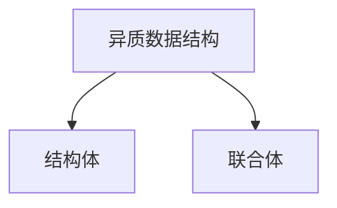

[TOC]

# 计算机系统漫游

* 计算机系统是由硬件和系统软件组成的

## 信息就是位+上下文

大部分的现代操作系统都使用ASCII标准类表示文本字符,这种方式实际上就是用一个唯一的单字节大小的整数值来表示每个字符

> C语言是贝尔实验室的Dennis Ritchie于1969年~1973年间创建的.美国国家标准学会(American National Standards Institute, ANSI)在1989年颁布了ANSI C的标准,后来C语言的标准化成了国际标准化组织(International Standards Organization, ISO)的责任.这些标准定义了C语言和一系列函数库,即所谓的C标准库.Kernighan和Ritchie在他们的经典著作中描述了ANSI C,这本著作被人们满怀感情地称为"K&R" .用Ritchie的话·来说, C语言是“古怪的、有缺陷的,但同时也是一个巨大的成功”.为什么会成功呢?
>
> * c语言与Unix操作系统关系密切.C从一开始就是作为一种用于Unix系统的程序语言开发出来的.大部分Unix内核(操作系统的核心部分),以及所有支撑工具和函数库都是用C语言编写的.20世纪70年代后期到80年代初期, Unix风行于高等院校,许多人开始接触C语言并喜欢上它.因为Unix几乎全部是用C编写的,它可以很为便地移植到新的机器上,这种特点为C和Unix赢得丁更为广泛的支特.
> * C语言小而简单.C语言的设计是由一个人而非一个协会掌控的,因此这是一个简洁明了、没有什么冗赘的设计. K&R这本书用大量的例子和练习描述了完整的C语言及其标准库,而全书不过261页.C语言的简单使它相对而言易于学习,也易于移植到不同的计算机上.
> * C语言是为实践目的设计的.C语言是设计用来实现Unix操作系统的.后来,其他人发现能够用这门语言无障碍地编写他们想要的程序.

## 程序被其他程序翻译成不同的格式


* 预处理阶段.预处理器(cpp)根据以字符#开头的命令,修改原始的C程序.比如hello.c中第1行的#include <stdio.h>命令告诉预处理器读取系统头文stdio.h的内容,并把它直接插入程序文本中.结果就得到了另一个C程序,通是以.i作为文件扩展名.
* 编译阶段.编译器(ccl)将文本文件hello.i翻译成文本文件hello.s,它包含一个汇编语言程序.
* 汇编阶段.接下来,汇编器(as)将hello.s翻译成机器语言指令,把这些指令打包成一种叫做可重定位目标程序(relocatable object program)的格式,并将结果保存在目标文件hello.o中.hello.o文件是一个二进制文件,它包含的17个字节是函数main的指令编码.如果我们在文本编辑器中打开hello.o文件,将看到一堆乱码.
* 链接阶段.请注意, hello程序调用了printf函数,它是每个C编译器都提供的标准C库中的一个函数.printf函数存在于一个名为printf.o的单独的预编译好了的目标文件中,而这个文件必须以某种方式合并到我们的hello..程序中.链接器(ld)就负责处理这种合并.结果就得到hello文件,它是一个可执行目标文件(或者简称为可执行文件),可以被加载到内存中,由系统执行.

> GCC是GNU(GNU是GNU's Not Unix的缩写)项目开发出来的众多有用工具之一. GNU项目是1984年由Richard Stallman发起的一个免税的慈善项目.该项目的目标非常宏大,就是开发出一个完整的类Unix的系统,其源代码能够不受限制地被修改和传播.GNU项目已经开发出了一个包含Unix操作系统的所有主要部件的环境,但内核除外, 内核是由Linux项目独立发展而来的.GNU环境包括EMACS编辑器、GCC编译器、GDB调试器、汇编器、链接器、处理二进制文件的工具以及其他一些部件.GCC编译器已经发展到支持许多不同的语言,能够为许多不同的机器生成代码.支持的语言包括C. C++、Fortran, Java, Pascal、面向对象C语言(Objective-C)和Ada.
>
> GNU项目取得了非凡的成绩,但是却常常被忽略.现代开放源码运动(通常和Linux联系在一起)的思想起源是GNU项目中自由软件(free software)的概念.(此处的free为自由言论(free speech)中的“自由”之意,而非免费啤酒(free beer)中的“免费”之意.)而且, Linux如此受欢迎在很大程度上还要归功于GNU工具,它们给Linux内核提供了环境.

## 了解编译系统如何工作是大有益处的

* 优化程序性能
* 理解链接时出现的错误
* 避免安全漏洞

## 处理器读并解释储存在内存中的指令

shell是一个命令行解释器,它输出一个提示符,等待输入一个命令行,然后执行这个命令.如果该命令行的第一个单词不是一个内置的shell命令,那么shell就会假设这是一个可执行文件的名字,它将加载并运行这个文件.

### 系统的硬件组成

#### 总线

贯穿整个系统的是一组电子管道,称作总线,它携带信息字节并负责在各个部件间传递.通常总线被设计成传送定长的字节块,也就是字(word).字中的字节数(即字长)是·个基本的系统参数,各个系统中都不尽相同.现在的大多数机器字长要么是4个字节(32位),要么是8个字节(64位)

#### I/O设备

I/0(输入/输出)设备是系统与外部世界的联系通道.

#### 主存

主存是一个临时存储设备,在处理器执行程序时,用来存放程序和程序处理的数据.从物理上来说,主存是由一组动态随机存取存储器(DRAM)芯片组成的.从逻辑上来说,存储器是一个线性的字节数组,每个字节都有其唯一的地址(数组索引),这些地址是从零开始的.一般来说,组成程序的每条机器指令都由不同数量的字节构成.与C程序变量相对应的数据项的大小是根据类型变化的.

#### 处理器

中央处理单元(CPU) ,简称处理器,是解释(或执行)存储在主存中指令的引擎.处理器的核心是一个大小为一个字的存储设备(或寄存器),称为程序计数器(PC).在任何时刻, PC都指向主存中的某条机器语言指令(即含有该条指令的地址),e从系统通电开始,直到系统断电,处理器一直在不断地执行程序计数器指向的指令,再更新程序计数器,使其指向下一条指令.处理器看上去是按照一个非常简单的指令执行模型来操作的,这个模型是由指令集架构决定的.在这个模型中,指令按照严格的顺序执行,而执行一条指令包含执行一系列的步骤.处理器从程序计数器指向的内存处读取指令,解释指令中的位,执行该指令指示的简单操作,然后更新PC,使其指向下一条指令,而这条指令并不一定和在内存中刚刚执行的指令相邻.

* 加载:从主存复制一个字节或者一个字到寄存器,以覆盖寄存器原来的内容.
* 存储:从寄存器复制一个字节或者一个字到主存的某个位置,以覆盖这个位置上原来的内容.
* 操作:把两个寄存器的内容复制到ALU, ALU对这两个字做算术运算,并将结果存放到一个寄存器中,以覆盖该寄存器中原来的内容.
* 跳转:从指令本身中抽取一个字,并将这个字复制到程序计数器(PC)中,以覆盖PC中原来的值.

## 高速缓存

根据机械原理,较大的存储设备要比较小的存储设备运行得慢,而快速设备的造价远高于同类的低速设备


类似地,一个典型的寄存器文件只存储几百字节的信息,而主存里可存放几十亿字节.然而,处理器从寄存器文件中读数据比从主存中读取几乎要快100倍.更麻烦的是,随着这些年半导体技术的进步,这种处理器与主存之间的差距还在持续增大.加快处理器的运行速度比加快主存的运行速度要容易和便宜得多.

针对这种处理器与主存之间的差异,系统设计者采用了更小更快的存储设备,称为高速缓存存储器(cache memory,简称为cache或高速缓存),作为暂时的集结区域,存放处理器近期可能会需要的信息.

高速缓存的局部性原理,即程序具有访问局部区域里的数据和代码的趋势.通过让高速缓存里存放可能经常访问的数据,大部分的内存操作都能在快速的高速缓存中完成.


<center>存储器层次结构</center>

## 操作系统管理硬件

我们可以把操作系统看成是应用程序和硬件之间插入的一层软件.

所有应用程序对硬件的操作尝试都必须通过操作系统.

操作系统有两个基本功能: (1)防止硬件被失控的应用程序滥用; (2)向应用程序提供简单一致的机制来控制复杂而又通常大不相同的低级硬件设备.操作系统通过几个基本的抽象概念(进程、虚拟内存和文件)来实现这两个功能.

### 进程

程序在现代系统上运行时,操作系统会提供一种假象,就好像系统上只有这个程序在运行.程序看上去是独占地使用处理器、主存和I/O设备.处理器看上去就像在不间断地一条接一条地执行程序中的指令,即该程序的代码和数据是系统内存中唯一的对象.这些假象是通过进程的概念来实现的,进程是计算机科学中最重要和最成功的概念之一

进程是操作系统对一个正在运行的程序的一种抽象.在一个系统上可以同时运行多个进程,而每个进程都好像在独占地使用硬件.而并发运行,则是说一个进程的指令和另一个进程的指令是交错执行的.在大多数系统中,需要运行的进程数是多于可以运行它们的CPU个数的.传统系统在一个时刻只能执行一个程序,而先进的多核处理器同时能够执行多个程序.无论是在单核还是多核系统中,一个CPU看上去都像是在并发地执行多个进程,这是通过处理器在进程间切换来实现的.操作系统实现这种交错执行的机制称为上下文切换.

操作系统保持跟踪进程运行所需的所有状态信息.这种状态,也就是上下文,包括许多信息,比如PC和寄存器文件的当前值,以及主存的内容.在任何一个时刻,单处理器系统都只能执行一个进程的代码.当操作系统决定要把控制权从当前进程转移到某个新进程时,就会进行上下文切换,即保存当前进程的上下文、恢复新进程的上下文,然后将控制权传递到新进程.新进程就会从它上次停止的地方开始.

### 线程

尽管通常我们认为一个进程只有单一的控制流,但是在现代系统中,一个进程实际上可以由多个称为线程的执行单元组成,每个线程都运行在进程的上下文中,并共享同样的代码和全局数据

由于网络服务器中对并行处理的需求,线程成为越来越重要的编程模型,因为多线程之间比多进程之间更容易共享数据,也因为线程一般来说都比进程更高效.当有多处理器可用的时候,多线程也是一种使得程序可以运行得更快的方法

### 虚拟内存

虚拟内存是一个抽象概念,它为每个进程提供了一个假象,即每个进程都在独占地使用主存.每个进程看到的内存都是一致的,称为虚拟地址空间

* 程序代码和数据.对所有的进程来说,代码是从同一固定地址开始,紧接着的是和C全局变量相对应的数据位置.
* 堆.代码和数据区后紧随着的是运行时堆.代码和数据区在进程一开始运行时就被指定了大小,与此不同,当调用像malloc和free这样的C标准库函数时,堆可以在运行时动态地扩展和收缩.
* 共享库.大约在地址空间的中间部分是一块用来存放像C标准库和数学库这样的共享库的代码和数据的区域.共享库的概念非常强大,也相当难懂.
* 栈.位于用户虚拟地址空间顶部的是用户栈,编译器用它来实现函数调用.和堆一样,用户栈在程序执行期间可以动态地扩展和收缩.特别地,每次我们调用一个函数时,栈就会增长;从一个函数返回时,栈就会收缩.
* 内核虚拟内存.地址空间顶部的区域是为内核保留的.不允许应用程序读写这个区域的内容或者直接调用内核代码定义的函数.相反,它们必须调用内核来执行这些操作.虚拟内存的运作需要硬件和操作系统软件之间精密复杂的交互,包括对处理器生成的每个地址的硬件翻译.基本思想是把一个进程虚拟内存的内容存储在磁盘上,然后用主存作为磁盘的高速缓存.

#### 虚拟地址的由来

在早期的计算机中，程序是直接运行到物理内存（可以理解为内存条上的内存）上的.也就是说，程序运行的时候直接访问的就是物理地址.如果，我们的一个计算机只运行一个程序，那么只有这个程序所需要的内存空间不超过物理内存空间的大小，就不会有问题.但是，我们正在希望的是在某个时候同时运行多个程序.那么这个时候，就会有个一个问题，==计算机如何把有限的物理内存分配给多个程序使用==呢？

某台计算机总的内存大小是128M，现在同时运行两个程序A和B，A需占用内存10M，B需占用内存110.计算机在给程序分配内存时会采取这样的方法：先将内存中的前10M分配给程序A，接着再从内存中剩余的118M中划分出110M分配给程序B.这种分配方法可以保证程序A和程序B都能运行，但是这种简单的内存分配策略问题很多.

* 问题1：进程地址空间不隔离.由于程序都是直接访问物理内存，所以恶意程序可以随意修改别的进程的内存数据，以达到破坏的目的.有些非恶意的，==但是有bug的程序也可能不小心修改了其它程序的内存数据，就会导致其它程序的运行出现异常==.这种情况对用户来说是无法容忍的，因为用户希望使用计算机的时候，其中一个任务失败了，至少不能影响其它的任务.
* 问题2：==内存使用效率低==.在A和B都运行的情况下，如果用户又运行了程序C，而程序C需要20M大小的内存才能运行，而此时系统只剩下8M的空间可供使用，所以此时系统必须在已运行的程序中选择一个将该程序的数据暂时拷贝到硬盘上，释放出部分空间来供程序C使用，然后再将程序C的数据全部装入内存中运行.可以想象得到，在这个过程中，有大量的数据在装入装出，导致效率十分低下.
* 问题3：程序运行的地址不确定.当内存中的剩余空间可以满足程序C的要求后，==操作系统会在剩余空间中随机分配一段连续的20M大小的空间给程序C使用，因为是随机分配的，所以程序运行的地址是不确定的==.但是我们的某些硬件是需要在固定的地址上去开始运行的，但是如果这个地址后边被我们的程序占有，那么我们对这块内存的修改，就可能导致某些硬件不可用了.

为了解决上述问题，人们想到了一种变通的方法，就是增加一个中间层，利用一种间接的地址访问方法访问物理内存.按照这种方法，程序中访问的内存地址不再是实际的物理内存地址，而是一个虚拟地址，然后由操作系统将这个虚拟地址映射到适当的物理内存地址上.这样，只要操作系统处理好虚拟地址到物理内存地址的映射，就可以保证不同的程序最终访问的内存地址位于不同的区域，彼此没有重叠，就可以达到内存地址空间隔离的效果.

#### 虚拟地址和物理地址映射

物理地址：物理地址空间是实在的存在于计算机中的一个实体，在每一台计算机中保持唯一独立性.我们可以称它为物理内存；如在32位的机器上，物理空间的大小理论上可以达到2^32字节(4GB)，但如果实际装了512的内存，那么其物理地址真正的有效部分只有512MB = 512 * 1024 KB = 512 * 1024 * 1024 B（0x00000000~0x1fffffff）.其他部分是无效的

虚拟地址：虚拟地址并不真实存在于计算机中.每个进程都分配有自己的虚拟空间，而且只能访问自己被分配使用的空间.理论上，虚拟空间受物理内存大小的限制，如给有4GB内存，那么虚拟地址空间的地址范围就应该是0x00000000~0xFFFFFFFF.每个进程都有自己独立的虚拟地址空间.这样每个进程都能访问自己的地址空间，这样做到了有效的隔离

在上面我们提到了合理的内存管理机制.我们这里虚拟地址和物理地址之间的映射是通过==MMU（内存管理单元）==来完成的


我们平时操作的内存其实都是通过操作虚拟地址的内存单元.通过通过MMU的映射来间接的操作我们的物理地址

## 系统之间利用网络通信

系统漫游至此,我们一直是把系统视为一个孤立的硬件和软件的集合体.实际上,系统经常通过网络和其他系统连接到一起.从一个单独的系统来看,网络可视为一个I/O设备.当系统从主存复制一串字节到网络适配器时,数据流经过网络到达另一台机器,而不是比如说到达本地磁盘驱动器.相似地,系统可以读取从其他机器发送来的数据,并把数据复制到自己的主存.


随着Internet这样的全球网络的出现,从一台主机复制信息到另外一台主机已经成为计算机系统最重要的用途之一.比如,像电子邮件、即时通信、万维网、FTP和telnet这样的应用都是基于网络复制信息的功能.

## Amdahl定律

Gene Amdahl,计算领域的早期先锋之一,对提升系统某一部分性能所带来的效果做出了简单却有见地的观察.这个观察被称为Amdahl定律(Amdahl's law),该定律的主要思想是,当我们对系统的某个部分加速时,其对系统整体性能的影响取决于该部分的重要性和加速程度.若系统执行某应用程序需要时间为$T_{old}$.假设系统某部分所需执行时间与该时间的比例为$\alpha$,而该部分性能提升比例为k.即该部分初始所需时间为$aT_{old}$,现在所需时间为$aT_{old}/k$.因此,总的执行时间应为
$$
T_{new}=(1-\alpha)T_{old}+(\alpha T_{old})/k=T_{old}[(1-\alpha)+\alpha/k]
$$
加速比:$S=\frac{T_{old}}{T_{new}}$
$$
S=\frac{1}{(1-\alpha)+\alpha/k}
$$
一个主要部分做出了重大改进,但是获得的系统加速比却明显小于这部分的加速比.这就是Amdahl定律的主要观点-要想显著加速整个系统,必须提升全系统中相当大的部分的速度

### 并发和并行

数字计算机的整个历史中,有两个需求是驱动进步的持续动力:一个是我们想要计算机做得更多,另一个是我们想要计算机运行得更快.当处理器能够同时做更多的事情时,这两个因素都会改进.我们用的术语并发(concurrency)是一个通用的概念,指一个同时具有多个活动的系统;而术语并行( parallelism)指的是用并发来使一个系统运行得更快.并行可以在计算机系统的多个抽象层次上运用.在此,我们按照系统层次结构中由高到低的顺序重点强调三个层次

#### 线程级并发

构建在进程这个抽象之上,我们能够设计出同时有多个程序执行的系统,这就导致了并发.使用线程,我们甚至能够在一个进程中执行多个控制流.自20世纪60年代初期出现时间共享以来,计算机系统中就开始有了对并发执行的支持.传统意义上,这种并发执行只是模拟出来的,是通过使一台计算机在它正在执行的进程间快速切换来实现的.在以前,即使处理器必须在多个任务间切换,大多数实际的计算也都是由一个处理器来完成的.这种配置称为单处理器系统

超线程,有时称为同时多线程(simultaneous multi-threading),是一项允许一个CPU执行多个控制流的技术.它涉及CPU某些硬件有多个备份,比如程序计数器和寄存器文件,而其他的硬件部分只有一份,比如执行浮点算术运算的单元.常规的处理器需要大约20000个时钟周期做不同线程间的转换,而超线程的处理器可以在单个周期的基础上决定要执行哪一个线程.这使得CPU能够更好地利用它的处理资源.


多处理器的使用可以从两方面提高系统性能.首先,它减少了在执行多个任务时模拟并发的需要.正如前面提到的,即使是只有一个用户使用的个人计算机也需要并发地执行多个活动.其次,它可以使应用程序运行得更快,当然,这必须要求程序是以多线程方式来书写的,这些线程可以并行地高效执行.因此,虽然并发原理的形成和研究已经超过50年的时间了,但是多核和超线程系统的出现才极大地激发了一种愿望,即找到书写应用程序的方法利用硬件开发线程级并行性.

#### 指令级并行

在较低的抽象层次上,现代处理器可以同时执行多条指令的属性称为指令级并行.

如果处理器可以达到比一个周期一条指令更快的执行速率,就称之为超标量(superscalar)处理器.大多数现代处理器都支持超标量操作

#### 单指令、多数据并行

在最低层次上,许多现代处理器拥有特殊的硬件,允许一条指令产生多个可以并行执行的操作,这种方式称为单指令、多数据,即SIMD并行.

提供这些SIMD指令多是为了提高处理影像、声音和视频数据应用的执行速度.

虽然有些编译器会试图从C程序中自动抽取SIMD并行性,但是更可靠的方法是用编译器支持的特殊的向量数据类型来写程序,比如GCC就支持向量数据类型.

### 计算机系统中抽象的重要性


抽象的使用是计算机科学中最为重要的概念之一

不同的编程语言提供不同形式和等级的抽象支持.在处理器里,指令集架构提供了对实际处理器硬件的抽象.使用这个抽象,机器代码程序表现得就好像运行在一个一次只执行一条指令的处理器上.底层的硬件远比抽象描述的要复杂精细,它并行地执行多条指令,但又总是与那个简单有序的模型保持一致.只要执行模型一样,不同的处理器实现也能执行同样的机器代码,而又提供不同的开销和性能.

# 程序结构和执行

## 信息的表示和处理

现代计算机存储和处理的信息以二值信号表示.这些微不足道的二进制数字,或者称为位(bit),形成了数字革命的基础.使用十进制表示法是很自然的事情,但是当构造存储和处理信息的机器时,二进制值工作得更好.二值信号能够很容易地被表示、存储和传输.

对二值信号进行存储和执行计算的电子电路非常简单和可靠,制造商能够在一个单独的硅片上集成数百万甚至数十亿个这样的电路.

孤立地讲,单个的位不是非常有用.然而,当把位组合在一起,再加上某种解释(interpretation),即赋予不同的可能位模式以含意,我们就能够表示任何有限集合的元素.通过使用标准的字符码,我们能够对文档中的字母和符号进行编码.

我们研究三种最重要的数字表示.无符号(unsigned)编码基于传统的二进制表示法,表示大于或者等于零的数字.补码(two's-complement)编码是表示有符号整数的最常见的方式,有符号整数就是可以为正或者为负的数字.浮点数(floating-point)编码是表示实数的科学记数法的以2为基数的版本.计算机用这些不同的表示方法实现算术运算,例如加法和乘法,类似于对应的整数和实数运算

通过研究数字的实际表示,我们能够了解可以表示的值的范围和不同算术运算的属性.为了使编写的程序能在全部数值范围内正确工作,而且具有可以跨越不同机器、操作系统和编译器组合的可移植性,了解这种属性是非常重要的.后面我们会讲到,大量计算·机的安全漏洞都是由于计算机算术运算的微妙细节引发的.在早期,当人们碰巧触发了程序漏洞,只会给人们带来一些不便,但是现在,有众多的黑客企图利用他们能找到的任何漏洞,不经过授权就进入他人的系统.这就要求程序员有更多的责任和义务,去了解他们的程序如何工作,以及如何被迫产生不良的行为

## 信息存储

大多数计算机使用8位的块,或者字节(byte),作为最小的可寻址的内存单位,而不是访问内存中单独的位.机器级程序将内存视为一个非常大的字节数组,称为虚拟内存(virtual memory),内存的每个字节都由一个唯一的数字来标识,称为它的地址(address),所有可能地址的集合就称为虚拟地址空间(virtual address space).顾名思义,这个虚拟地址空间只是一个展现给机器级程序的概念性映像.实际的实现是将动态随机访问存储器(DRAM)、闪存、磁盘存储器、特殊硬件和操作系统软件结合起来,为程序提供一个看上去统一的字节数组.

C编译器还把每个指针和类型信息联系起来,这样就可以根据指针值的类型,生成不同的机器级代码来访问存储在指针所指向位置处的值.尽管C编译器维护着这个类型信息,但是它生成的实际机器级程序并不包含关于数据类型的信息.每个程序对象可以简单地视为一个字节块,而程序本身就是一个字节序列.

> C语言中指针的作用指针是C语言的一个重要特性.它提供了引用数据结构(包括数组)的元素的机制.与变量类似,指针也有两个方面:值和类型.它的值表示某个对象的位置,而它的类型表示那个位置上所存储对象的类型(比如整数或者浮点数)

### 十六进制表示法

一个字节由8位组成.在二进制表示法中,它的值域是$000000_2 \backsim 11111111_2$ 如果看成十进制整数,它的值域就是$0_{10}\backsim255_{10}$.两种符号表示法对于描述位模式来说都不是非常方便.二进制表示法太冗长,而十进制表示法与位模式的互相转化很麻烦.替代的方法是以16为基数,或者叫做十六进制(hexadecimal)数,来表示位模式.

十六进制(简写为"hex")使用数字’0’, ~ ‘9’,以及字符’A’ ~ ‘F’,来表示16个可能的值

在C语言中,以0x或0x开头的数字常量被认为是十六进制的值

### 字数据大小

每台计算机都有一个字长(word size) ,指明指针数据的标称大小(nominal size),因为虚拟地址是以这样的一个字来编码的,所以字长决定的最重要的系统参数就是虚拟地址空间的最大大小.也就是说,对于一个字长为$w$位的机器而言,虚拟地址的范围为$0\backsim2^w-1$,程序最多访问$2^w$个字节


为了避免由于依赖“典型”大小和不同编译器设置带来的奇怪行为, ISO C99引入了一类数据类型,其数据大小是固定的,不随编译器和机器设置而变化.其中就有数据类型int32_t和int64_t,它们分别为4个字节和8个字节.使用确定大小的整数类型是程序员准确控制数据表示的最佳途径

程序员应该力图使他们的程序在不同的机器和编译器上可移植.可移植性的一个方面就是使程序对不同数据类型的确切大小不敏感.C语言标准对不同数据类型的数字范围设置了下界,但是却没有上界

### 寻址和字节顺序

对于跨越多字节的程序对象,我们必须建立两个规则:这个对象的地址是什么,以及在内存中如何排列这些字节.在几乎所有的机器上,多字节对象都被存储为连续的字节序列,对象的地址为所使用字节中最小的地址

对于大多数应用程序员来说,其机器所使用的字节顺序是完全不可见的.无论为哪种类型的机器所编译的程序都会得到同样的结果.不过有时候,字节顺序会成为问题.在不同类型的机器之间通过网络传送二进制数据时,一个常见的问题是当小端法机器产生的数据被发送到大端法机器或者反过来时,接收程序会发现,字里的字节成了反序的.为了避免这类问题,网络应用程序的代码编写必须遵守已建立的关于字节顺序的规则,以确保发送方机器将它的内部表示转换成网络标准,而接收方机器则将网络标准转换为它的内部表示


对于int类型的数据,除了字节顺序以外,我们在所有机器上都得到相同的结果.特别地,我们可以看到在Linux 32、 Windows和Linux 64上,最低有效字节值0x39最先输出,这说明它们是小端法机器;而在Sun上最后输出,这说明Sun是大端法机器.同样地, float数据的字节,除了字节顺序以外,也都是相同的.另一方面,指针值却是完全不同的.不同的机器/操作系统配置使用不同的存储分配规则.一个值得注意的特性是Linux 32, Windows和Sun的机器使用4字节地址,而Linux 64使用8字节地址

> 使用printf格式化输出
>
> printf函数(还有它的同类fprintf和sprintf)提供了一种打印信息的方式,这种方式对格式化细节有相当大的控制能力.第一个参数是格式串(format string),而其余的参数都是要打印的值.在格式串里,每个以“%”开始的字符序列都表示如何格式化下一个参数

> 文字编码的Unicode标准
>
> ASCII字符集适合于编码英语文档,但是在表达一些特殊字符方面并没有太多办法,例如法语的“Ç".它完全不适合编码希腊语、俄语和中文等语言的文档.这些年提出了很多方法来对不同语言的文字进行编码.Unicode联合会(Unicode Consortium)修订了最全面且广泛接受的文字编码标准.当前的Unicode标准(7.0版)的字库包括将近100000个字符,支持广泛的语言种类,包括古埃及和巴比伦的语言.为了保持信用, Unicode技术委员会否决了为Klingon(即电视连续剧《星际迷航》中的虚构文明)编写语言标准的提议.
>
> 基本编码,称为Unicode的“统一字符集”,使用32位来表示字符.这好像要求文本串中每个字符要占用4个字节.不过,可以有一些替代编码,常见的字符只需要1个或2个字节,而不太常用的字符需要多一些的字节数.特别地, UTF-8表示将每个字符编码为一个字节序列,这样标准ASCII字符还是使用和它们在ASCII中一样的单字节编码,这也就意味着所有的ASCII字节序列用ASCII码表示和用UTF-8表示是一样的.Java编程语言使用Unicode来表示字符串.对于C语言也有支持Unicode的程序库

### 表示代码

我们发现指令编码是不同的.不同的机器类型使用不同的且不兼容的指令和编码方·式.即使是完全一样的进程,运行在不同的操作系统上也会有不同的编码规则,因此二进制代码是不兼容的.二进制代码很少能在不同机器和操作系统组合之间移植

### 布尔代数简介

二进制值是计算机编码、存储和操作信息的核心,所以围绕数值0和1的研究已经演化,出了丰富的数学知识体系.这起源于1850年前后乔治·布尔(George Boole, 1815-1864)的工作,因此也称为布尔代数(Boolean algebra),布尔注意到通过将逻辑值TRUE (真)和FALSE(假)编码为二进制值1和0,能够设计出一种代数,以研究逻辑推理的基本原则

### C语言中的位级运算

C语言的一个很有用的特性就是它支持按位布尔运算.事实上,我们在布尔运算中使用的那些符号就是C语言所使用的:|就是OR(或), &就是AND(与), ~就是NOT(取反),而^就是EXCLUSIVE-OR(异或)

| 逻辑 | 符号 |
| ---- | ---- |
| 或   | \|   |
| 与   | &    |
| 非   | ~    |
| 异或 | ^    |

### c语言中的逻辑运算

C语言还提供了一组逻辑运算符||、 &&和!,分别对应于命题逻辑中的OR,AND和NOT运算.逻辑运算很容易和位级运算相混淆,但是它们的功能是完全不同的

逻辑运算认为所有非零的参数都表示TRUE,而参数0表示FALSE,它们返回1或者0,分别表示结果为TRUE或者为FALSE

逻辑运算符&&和||与它们对应的位级运算&和|之间第二个重要的区别是,如果对第一个参数求值就能确定表达式的结果,那么逻辑运算符就不会对第二个参数求值

### c语言言中的移位运算

C语言还提供了一组移位运算,向左或者向右移动位模式.

有一个相应的右移运算x>>k,但是它的行为有点微妙.一般而言,机器支持两种形式的右移:逻辑右移和算术右移.


斜体的数字表示的是最右端(左移)或最左端(右移)填充的值.可以看到除了一个条目之外,其他的都包含填充0.唯一的例外是算术右移[10010101]的情况.因为操作数的最高位是1,填充的值就是1

与C相比, Java对于如何进行右移有明确的定义.表达是x>>k会将x算术右移k个位置,而x>>>k会对x做逻辑右移

## 整数表示


### 整型数据类型

C语言支持多种整型数据类型-表示有限范围的整数.

每种类型都能用关键字来指定大小,这些关键字包括char, short, long,同时还可以指示被表示的数字是非负数(声明为unsigned),或者可能是负数(默认).为这些不同的大小分配的字节数根据程序编译为32位还是64位而有所不同.根据字节分配,不同的大小所能表示的值的范围是不同的


> C、 C++和Java中的有符号和无符号数
>
> C和C++都支持有符号(默认)和无符号数.Java只支持有符号数

### 无符号数的编码

对向量$\vec{x}=[x_{w-1},x_{w-2},\cdots,x_0]:$
$$
B2U_w(\vec x)\approx \sum^{w-1}_{i=0}{x_i2^i}
$$
无符号数的二进制表示有一个很重要的属性,也就是每个介于$0\sim2^n-1$之间的数都·有唯一一个w位的值编码

原理:无符号数编码的唯一性

函数$B2U_w$是一个双射

数学术语双射是指一个函数f有两面:它将数值x映射为数值y,即y=f(x),但它也可以反向操作,因为对每一个y而言,都有唯一一个数值x使得f(x)=y,这可以用反函数$f^{-1}$来表示.函数$B2U_w$将每一个长度为w的位向量都映射为$0\backsim2^n-1$之间的一个唯一值;反过来,我们称其为$U2B_w$(即“无符号数到二进制"),在$0\backsim2^n-1$之间的每一个整数都可以映射为一个唯一的长度为w的位模式

### 补码编码

对于许多应用,我们还希望表示负数值.最常见的有符号数的计算机表示方式就是补码(two' s-complement)形式.在这个定义中,将字的最高有效位解释为负权(negativeweight),我们用函数$B2T_w$(Binary to Two's-complement的缩写,长度为w)来表示

补码编码定义

对向量$\vec x=[x_{w-1},x_{w-2},\cdots,x_0]$
$$
B2T_w(\vec x)\approx -x_{w-1}w^{w-1}+\sum^{w-2}_{i=0}x_iw^i
$$
最高有效位$x_{w-1}$也称为符号位,它的“权重”为$-2^{w-1}$,是无符号表示中权重的负数.符号位被设置为1时,表示值为负,而当设置为0时,值为非负

原理:补码编码的唯一性

函数$B2T_w$是一个双射

我们定义函数$T2B_w$. (即“补码到二进制”)作为$B2T_w$的反函数.也就是说,对于每个数x,满足$TMin_w\leq x\leq TMax_w$,则$T2B_w(x)$是x的(唯一的)w位模式

### 有符号数和无符号数之间的转换

C语言允许在各种不同的数字数据类型之间做强制类型转换.很明显,对于在两种形式中都能表示的值,我们是想要保持不变的.另一方面,将负数转换成无符号数可能会得到0.如果转换的无符号数太大以至于超出了补码能够表示的范围,可能会得到$TMax$,不过,对于大多数C语言的实现来说,对这个问题的回答都是从位级角度来看的,而不是数的角度

对于大多数C语言的实现,处理同样字长的有符号数和无符号数之间相互转换的一般规则是:数值可能会改变,但是位模式不变.让我们用更数学化的形式来描述这个规则.我们定义函数$U2B_w$和$T2B_w$,它们将数值映射为无符号数和补码形式的位表示.也就是说,给定$0\leq x\leq UMax_w$范围内的一个整数x,函数$U2B_w(x)$会给出x的唯一的w位无符号表示.相似地,当满足$TMin_w\leq x\leq TMax_w$,函数$T2B_w(x)$会给出x的唯一的w位补码表示

无符号表示中的UMar有着和补码表示的-1相同的位模式.我们在这两个数之间也能看到这种关系: $1+UMax_w=2^w$

补码转换为无符号数
$$
B2U_w(T2B_w(x))=T2U_w(x)=x+x_{w-1}2^w
$$
当将一个有符号数映射为它相应的无符号数时,负数就被转换成了大的正数,而非负数会保持不变

无符号数转换为补码
$$
U2T_w(u)=-u_{w-1}2^w+u
$$


### C语言中的有符号数与无符号数

C语言支持所有整型数据类型的有符号和无符号运算.尽管C语言标准没有指定有符号数要采用某种表示,但是几乎所有的机器都使用补码.通常,大多数数字都默认为是有符号的.要创建一个无符号常量,必须加上后缀字符"u'或者'u'

C语言允许无符号数和有符号数之间的转换.虽然C标准没有精确规定应如何进行这种转换,但大多数系统遵循的原则是底层的位表示保持不变.因此,在一台采用补码的机器上,当从无符号数转换为有符号数时,效果就是应用函数$U2T_w$,而从有符号数转换为无符号数时,就是应用函数$T2U_w$,,其中w表示数据类型的位数

### 扩展一个数字的位表示

一个常见的运算是在不同字长的整数之间转换,同时又保持数值不变.当然,当目标数据类型太小以至于不能表示想要的值时,这根本就是不可能的.然而,从一个较小的数据类型转换到一个较大的类型,应该总是可能的

要将一个无符号数转换为一个更大的数据类型,我们只要简单地在表示的开头添加0.这种运算被称为零扩展(zero extension)

无符号数的零扩展

定义宽度为w的位向量$\vec u=[u_{w-1}, u_{w-2},\cdots,u_0]$和宽度为$w'$的位向量$\vec u'=[0,\cdots,0,u_{w-1}, u_{w-2},\cdots,u_o]$,其中$w'>w$.则$B2U_w(\vec u)=B2U_{w'}(\vec u')$

补码数的符号扩展

定义宽度为w的位向量$\vec x=[x_{w-1}, x_{w-2},\cdots,x_0]$和宽度为w的位向量$\vec x'=[x_{w-1},\cdots,x_{w-1},x_{w-1},x_{w-2},\cdots,x_0]$,其中$w'>w$.则$B2U_w(\vec u)=B2U_{w'}(\vec u')$

### 截断数字

原理:截断无符号数

令$\vec x$等于位向量$[x_{w-1}, x_{w-2},\cdots,x_0]$,而$\vec x'$是将其截断为k位的结果:$\vec x'=[x_{k-1},x_{k-2},\cdots,x_0]$.令$x=B2U_w(\vec x)),$ $x'=B2U_k(\vec x')$.则$x'=x mod 2^k$

原理:截断补码数值

令$\vec x$ 等于位向量$[x_{w-1} , x_{w-2},\cdots,x_0]$,而$\vec x'$是将其截断为k位的结果: $\vec x'=[x_{k-1},x_{k-2},\cdots,x_0]$.令$x=B2U_w(\vec x)$,$x'=B2T_k(\vec x')$,则$x'=U2T_k(x mod 2^k)$

### 关于有符号数与符号数的建议

有符号数到无符号数的隐式强制类型转换导致了某些非直观的行为.而这些非直观的特性经常导致程序错误,并且这种包含隐式强制类型转换的细微差别的错误很难被发现.因为这种强制类型转换是在代码中没有明确指示的情况下发生的,程序员经常忽视了它的影响

我们已经看到了许多无符号运算的细微特性,尤其是有符号数到无符号数的隐式转换,会导致错误或者漏洞的方式.避免这类错误的一种方法就是绝不使用无符号数.实际上,除了C以外很少有语言支持无符号整数.很明显,这些语言的设计者认为它们带来的麻烦要比益处多得多.比如, Java只支持有符号整数,并且要求以补码运算来实现.正常的右移运算符>>被定义为执行算术右移.特殊的运算符>>>被指定为执行逻辑右移.

## 整数运算

### 无符号加法


对满足0<x, y<$2^w$的x和y有
$$
x+^u_wy=\begin{cases}
x+y&x+y<2^w\\
x+y-2^w&2^w\leq x+y< 2^{w+1}
\end{cases}
$$


​	模数加法形成了一种数学结构,称为阿贝尔群(Abelian group),这是以丹麦数学家Niels Henrik Abel( 1802~1829)的名字命名.也就说,它是可交换的和可结合的.它有一个单位元0,并且每个元素有一个加法逆元

原理:无符号数求反

对满足$0\leq x<2^w$的任意x ,其w位的无符号逆元$-^u_wx$由下式给出
$$
-^u_wx=\begin{cases}x&x=0\\2^w-x&x>0\end{cases}
$$

### 补码加法

对满足$-2^{w-1}\leq x,y\leq 2^{w-1}-1$的整数x和y,有:
$$
x+^t_wy=\begin{cases}
x+y-2^w&w^{w-1}\leq x+y&正溢出\\
x+y&-2^{w-1}\leq x+y<2^{w-1}&正常\\
x+y+2^w&x+y<-w^{w-1}&负溢出
\end{cases}
$$


### 无符号乘法

范围在$0\leq x, y\leq 2^w-1$内的整数x和y可以被表示为w位的无符号数,但是它们的乘积$x\cdot y$的取值范围为0到$(2^w-1)^2=2^{2w}-2^{w+1}+1$之间.这可能需要2w位来表示.不过, C语言中的无符号乘法被定义为产生w位的值,就是2w位的整数乘积的低w位表示的值.我们将这个值表示为$x*^u_wy$

对满足$0\leq x, y\leq UMax_w$的x和y有:
$$
x*^u_wy=(x\cdot y)\mod 2^w
$$

### 补码的非

对满足$TMin_w\leq x\leq TMax_w$的x,其补码的非$-^t_wx$由下式給出
$$
-^t_wx=\begin{cases}TMin_w&x=TMin_w\\-x&x>TMin_w\end{cases}
$$

### 无符号乘法

对满足$0\leq x,y\leq UMax_w$的x和y,有
$$
x*^u_wy=(x\cdot y)\mod 2^w
$$

### 补码乘法

对满足$TMin_w\leq x,y\leq TMax_w$的x和y,有
$$
x*^t_wy=U2T_w((x\cdot y)\mod 2^w)
$$
给定长度为w的位向量$\vec x$和$\vec y$,用补码形式的位向量表示来定义整数x和y:$x=B2T_w(\vec x),y'=B2T_w(\vec y)$.用无符号形式的位向量表示来定义非负整数x'和y':$x'=B2U_w(\vec x),y'=B2U_w(\vec y)$.则
$$
T2B_w(x*^t_wy)=U2B_w(x'*^u_wy')
$$

### 乘以常数

设x为位模式$[x_{w-1},x_{w-2},\cdots,x_0]$表示的无符号整数,那么对于任何$k\geq 0$,我们都认为$[x_{w-1},x_{w-2},\cdots,x_0,0,\cdots,0]$给出了$x2^k$的w+k位的无符号表示,这里的右边增加了k个0

### 除以2的幂

除以2的幂也可以用移位运算来实现,只不过我们用的是右移,而不是左移.无符号和补,码数分别使用逻辑移位和算术移位来达到目的

除以2的幂的无符号除法,C变量x和k有无符号数值x和k,且$0\leq k<w$,则C表达式x>>k产生数值$\lfloor \frac{x}{2^k}\rfloor$

除以2 的幂的补码除法,向下舍入,C变量x和k分别由补码值x和无符号数值k,且$0\leq k<w$,则当执行算术移位时,C表达式x>>k产生数值$\lfloor \frac{x}{2^k}\rfloor$

## 浮点数

大约在1985年,这些情况随着IEEE标准754的推出而改变了,这是一个仔细制订的表示浮点数及其运算的标准.这项工作是从1976年开始由Intel赞助的,与8087的设计同时进行, 8087是一种为8086处理器提供浮点支持的芯片.他们请William Kahan(加州大学伯克利分校的一位教授)作为顾问,帮助设计未来处理器浮点标准.他们支持Kahan加入一个IEEE资助的制订工业标准的委员会.这个委员会最终采纳的标准非常接近于Kahan为Intel设计的标准.目前,实际上所有的计算机都支持这个后来被称为IEEE浮点的标准.这大大提高了科学应用程序在不同机器上的可移植性.

### 二进制小数

十进制表示法
$$
d_md_{m-1}\cdots d_1d_0.d_{-1}d_{-2}\cdots d_{-n}
$$
其中每个十进制数$d_i$的取值范围是0~9,定义为
$$
d=\sum^m_{i=-n}10^i\times d_i
$$
数字权的定义与十进制小数点符号(‘.’)相关,这意味着小数点左边的数字的权是10的正幂,得到整数值,而小数点右边的数字的权是10的负幂,得到小数值


### IEЕE 浮点表示

* 符号(sign) s决定这数是负数(s=1)还是正数(s=0),而对于数值0的符号位解释作为特殊情况处理
* 尾数(significand) M是一个二进制小数,它的范围是$1\sim2-\epsilon$ ,或者是$0\sim1-\epsilon$
* 阶码(exponent) E的作用是对浮点数加权,这个权重是2的E次幂(可能是负数)

浮点数的位表示划分为三个字段,分别对这些值进行编码

* 一个单独的符号位s直接编码符号s.
* k位的阶码字段$exp=e_{k-1}\cdots e_1e_0$编码阶码E
* n位小数字段$frac=f_{n-1}\cdots f_1f_0$编码尾数M,但是编码出来的值也依赖于阶码字段的值是否等于0


#### 规格化的值

小数字段frac被解释为描述小数值f,其中$0\leq f<1$,其二进制表示为$0,f_{n-1}\cdots f_1f_0$,也就是二进制小数点在最高有效位的左边.尾数定义为M=1+f,有时,这种方式也叫做隐含的以1开头的(implied leading 1)表示,因为我们可以把M看成一个二进制表达式为$1.f_{n-1}f-{n-2}\cdots f_0$的数字.既然我们总是能够调整阶码E,使得尾数M在范围$1\leq M<2$之中(假设没有溢出),那么这种表示方法是一种轻松获得一个额外精度位的技巧.既然第一位总是等于1,那么我们就不需要显式地表示它

#### 非规格化的值

当阶码域为全0时,所表示的数是非规格化形式.在这种情况下,阶码值是E=1-Bias,而尾数的值是M=f,也就是小数字段的值,不包含隐含的开头的1

非规格化数有两个用途.首先,它们提供了一种表示数值0的方法,因为使用规格化数,我们必须总是使M>1,因此我们就不能表示0.实际上, +0.0的浮点表示的位模式为全0:符号位是0,阶码字段全为0(表明是一个非规格化值),而小数域也全为0,这就得到$M=f=0$,令人奇怪的是,当符号位为1,而其他域全为0时,我们得到值-0.0.根据IEEE的浮点格式,值+0.0和-0.0在某些方面被认为是不同的,而在其他方面是相同的

非规格化数的另外一个功能是表示那些非常接近于0.0的数.它们提供了一种属性,称为逐渐溢出(gradual underflow),其中,可能的数值分布均匀地接近于0.0

#### 特殊值

最后一类数值是当指阶码全为1的时候出现的.当小数域全为0时,得到的值表示无穷,当s=0时是十∞,或者当s=1时是-∞.当我们把两个非常大的数相乘,或者除以零时,无穷能够表示溢出的结果.当小数域为非零时,结果值被称为"NaN",即“不是一个数(Not a Number)"的缩写.一些运算的结果不能是实数或无穷,就会返回这样的NaN值,比如当计算$\sqrt{-1}$或∞-∞时


### 舍入

因为表示方法限制了浮点数的范围和精度,所以浮点运算只能近似地表示实数运算.因此,对于值x,我们一般想用一种系统的方法,能够找到“最接近的”匹配值x',它可以用期望的浮点形式表示出来.这就是舍入(rounding)运算的任务.一个关键问题是在两个可能值的中间确定舍入方向.一种可选择的方法是维持实际数字的下界和上界.例如,我们可以确定可表示的值$x^-$和$x^+$,使得x的值位于它们之间: $x^-\leq x\leq x^+$.IEEE浮点格式定义了四种不同的舍入方式.默认的方法是找到最接近的匹配,而其他三种可用于计算上界和下界


其他三种方式产生实际值的确界(guaranteed bound).向零舍入方式把正数向下舍人,把负数向上舍人,得到值立,使得12<lxl..向下舍入方式把正数和负数都向下舍人,得到值x,,使得x<x.向上舍入方式把正数和负数都向上舍入,得到值xt ,满足x<x

### 浮点运算

IEEE标准中指定浮点运算行为方法的一个优势在于,它可以独立于任何具体的硬件或者软件实现.因此,我们可以检查它的抽象数学属性,而不必考虑它实际上是如何实现的.

实数上的加法也形成了阿贝尔群,但是我们必须考虑舍人对这些属性的影响.我们将$x+^fy$定义为$Round(x+y)$.这个运算的定义针对x和y的所有取值,但是虽然x和y都是实数,由于溢出,该运算可能得到无穷值.对于所有x和y的值,这个运算是可交换的,也就是说$x+^fy=y+^fx$.另一方面,这个运算是不可结合的.作为阿贝尔群,大多数值在浮点加法下都有逆元,也就是说$x+^f-x=0$,无穷(因为+∞-∞=NaN)和NaN是例外情况,因为对于任何x,都有$NaN+^fx=NaN$

### C语言中的浮点数

所有的C语言版本提供了两种不同的浮点数据类型: float和double.在支持IEEE浮点格式的机器上,这些数据类型就对应于单精度和双精度浮点.另外,这类机器使用向偶数舍人的舍入方式.不幸的是,因为C语言标准不要求机器使用IEEE浮点,所以没有标准的方法来改变舍入方式或者得到诸如-0,+∞,-∞或者NaN之类的特殊值

* 从int转换成float,数字不会溢出,但是可能被舍人
* 从int或float转换成double,因为double有更大的范围(也就是可表示值的范围),也有更高的精度(也就是有效位数),所以能够保留精确的数值
* 从double转换成float,因为范围要小一些,所以值可能溢出成+∞或-∞.另外,由于精确度较小,它还可能被舍人
* 以float或者double转换成int,值将会向零舍入

# 程序的机器级表示

计算机执行机器代码,用字节序列编码低级的操作,包括处理数据、管理内存、读写存储设备上的数据,以及利用网络通信.编译器基于编程语言的规则、目标机器的指令集和操作系统遵循的惯例,经过一系列的阶段生成机器代码.GCC C语言编译器以汇编代码的形式产生输出,汇编代码是机器代码的文本表示,给出程序中的每一条指令.然后GCC调用汇编器和链接器,根据汇编代码生成可执行的机器代码.在本章中,我们会近距离地观察机器代码,以及人类可读的表示-汇编代码

即使编译器承担了生成汇编代码的大部分工作,对于严谨的程序员来说,能够阅读和理解汇编代码仍是一项很重要的技能.以适当的命令行选项调用编译器,编译器就会产生一个以汇编代码形式表示的输出文件.通过阅读这些汇编代码,我们能够理解编译器的优化能力,并分析代码中隐含的低效率.试图最大化一段关键代码性能的程序员,通常会尝试源代码的各种形式,每次编译并检查产生的汇编代码,从而了解程序将要运行的效率如何.此外,也有些时候,高级语言提供的抽象层会隐藏我们想要了解的程序的运行时行为.例如,用线程包写并发程序时,了解不同的线程是如何共享程序数据或保持数据私有的,以及准确知道如何在哪里访问共享数据,都是很重要的.这些信息在机器代码级是可见的.另外再举一个例子,程序遭受攻击(使得恶意软件侵扰系统)的许多方式中,都涉及程序存储运行时控制信息的方式的细节.许多攻击利用了系统程序中的漏洞重写信息,从而获得了系统的控制权.了解这些漏洞是如何出现的,以及如何防御它们,需要具备程序机器级表示的知识.程序员学习汇编代码的需求随着时间的推移也发生了变化,开始时要求程序员能直接用汇编语言编写程序,现在则要求他们能够阅读和理解编译器产生的代码.

> 摩尔定律(Moore's Law)
>
> 如果我们画出各种不同的Intel处理器中晶体管的数量与它们出现的年份之间的图(y轴为晶体管数量的对数值),我们能够看出,增长是很显著的.画一条拟合这些数据的线,可以看到晶体管数量以每年大约37%的速率增加,也就是说,晶体管数量每26个月就会翻一番.在x86微处理器的历史上,这种增长已经持续了好几十年.
>
> 
>
> 1965年, Gordon Moore, Intel公司的创始人,根据当时的芯片技术(那时他们能够在,一个芯片上制造有大约64个晶体管的电路)做出推断,预测在未来10年,芯片上的晶体管数量每年都会翻一番.这个预测就称为摩尔定律.正如事实证明的那样,他的预测有点乐观,而且短视.在超过50年中,半导体工业一直能够使得晶体管数目每18个月翻一倍.

## 程序编码

假设一个C程序,有两个文件p1.c和p2.c.我们用Unix命令行编译这些代码:

```
linux> gcc -Og -S p1.c p2.c
```

命令gcc指的就是GCC C编译器.因为这是Linux上默认的编译器,我们也可以简单地用cc来启动它.编译选项-0g告诉编译器使用会生成符合原始C代码整体结构的机器代码的优化等级.使用较高级别优化产生的代码会严重变形,以至于产生的机器代码和初始源代码之间的关系非常难以理解.因此我们会使用-0g优化作为学习工具,然后当我们增加优化级别时,再看会发生什么.

实际上gcc命令调用了一整套的程序,将源代码转化成可执行代码.首先, C预处理器扩展源代码,插入所有用#include命令指定的文件,并扩展所有用#define声明指定的宏.其次,编译器产生两个源文件的汇编代码,名字分别为p1.s和p2.s,接下来,汇编器会将汇编代码转化成二进制目标代码文件p1.o和p2.0,目标代码是机器代码的一种形式,它包含所有指令的二进制表示,但是还没有填入全局值的地址.最后,链接器将两个目标代码文件与实现库函数(例如printf)的代码合并,并产生最终的可执行代码文件p(由命令行指示符-o p指定的).可执行代码是我们要考虑的机器代码的第二种形式,也就是处理器执行的代码格式.

### 机器级代码

计算机系统使用了多种不同形式的抽象,利用更简单的抽象模型来隐藏实现的细节.对于机器级编程来说,其中两种抽象尤为重要.

第一种是由指令集体系结构或指令集架构(Instruction Set Architecture, ISA)来定义机器级程序的格式和行为,它定义了处理器状态、指令的格式,以及每条指令对状态的影响.大多数ISA,包括x86-64,将程序的行为描述成好像每条指令都是按顺序执行的,一条指令结束后,下一条再开始.处理器的硬件远比描述的精细复杂,它们并发地执行许多指令,但是可以采取措施保证整体行为与ISA指定的顺序执行的行为完全一致.

第二种抽象是,机器级程序使用的内存地址是虚拟地址,提供的内存模型看上去是一个非常大的字节数组.存储器系统的实际实现是将多个硬件存储器和操作系统软件组合起来.

在整个编译过程中,编译器会完成大部分的工作,将把用C语言提供的相对比较抽象的执行模型表示的程序转化成处理器执行的非常基本的指令.汇编代码表示非常接近于机器代码.与机器代码的二进制格式相比,汇编代码的主要特点是它用可读性更好的文本格式表示.能够理解汇编代码以及它与原始C代码的联系,是理解计算机如何执行程序的关键一步.

x86-64的机器代码和原始的C代码差别非常大.一些通常对C语言程序员隐藏的处理器状态都是可见的

* 程序计数器(通常称为"PC",在x86-64中用%rip表示)给出将要执行的下一条指令在内存中的地址
* 整数寄存器文件包含16个命名的位置,分别存储64位的值.这些寄存器可以存储地址(对应于C语言的指针)或整数数据.有的寄存器被用来记录某些重要的程序状态,而其他的寄存器用来保存临时数据,例如过程的参数和局部变量,以及函数的返回值
* 条件码寄存器保存着最近执行的算术或逻辑指令的状态信息.它们用来实现控制或数据流中的条件变化,比如说用来实现if和while语句
* 一组向量寄存器可以存放一个或多个整数或浮点数值

程序内存包含:程序的可执行机器代码,操作系统需要的一些信息,用来管理过程调用和返回的运行时栈,以及用户分配的内存块(比如说用malloc库函数分配的).正如前面提到的,程序内存用虚拟地址来寻址.在任意给定的时刻,只有有限的一部分虚拟地址被认为是合法的.在目前的实现中,这些地址的高16位必须设置为0,所以一个地址实际上能够指定的是$2^{48}$或$64TB$范围内的一个字节.较为典型的程序只会访问几兆字节或几千兆字节的数据.操作系统负责管理虚拟地址空间,将虚拟地址翻译成实际处理器内存中的物理地址

一条机器指令只执行一个非常基本的操作

#### 产生汇编代码

```
linux> gcc -Og -S mstore.c
```

这会使GCC运行编译器,产生一个汇编文件mstore.s,但是不做其他进一步的工作.(通常情况下,它还会继续调用汇编器产生目标代码文件)

```
linux> gcc -Og -c mstore.c
```

这就会产生目标代码文件mstore.o,它是二进制格式的,所以无法直接查看

#### 产生机器代码

要查看机器代码文件的内容,有一类称为反汇编器(disassembler)的程序非常有用.这些程序根据机器代码产生一种类似于汇编代码的格式.在Linux系统中,带‘-d’命令行标志的程序OBJDUMP(表示"object dump")可以充当这个角色

```
linux> objdump -d mstore.o
```

其中一些关于机器代码和它的反汇编表示的特性值得注意:

* x86-64的指令长度从1到15个字节不等.常用的指令以及操作数较少的指令所需的字节数少,而那些不太常用或操作数较多的指令所需字节数较多
* 设计指令格式的方式是,从某个给定位置开始,可以将字节唯一地解码成机器指令
* 反汇编器只是基于机器代码文件中的字节序列来确定汇编代码.它不需要访问该程序的源代码或汇编代码
* 反汇编器使用的指令命名规则与GCC生成的汇编代码使用的有些细微的差别

### 关于格式的注解

所有以‘.’开头的行都是指导汇编器和链接器工作的伪指令.我们通常可以忽略这些行.另一方面,也没有关于指令的用途以及它们与源代码之间关系的解释说明

通常我们只会给出与讨论内容相关的代码行.每一行的左边都有编号供引用,右边是·注释,简单地描述指令的效果以及它与原始C语言代码中的计算操作的关系.这是一种汇编语言程序员写代码的风格

> 把C程序和汇编代码结合起来
>
> 虽然C编译器在把程序中表达的计算转换到机器代码方面表现出色,但是仍然有一些机器特性是C程序访问不到的.例如,每次x86-64处理器执行算术或逻辑运算时,如果得到的运算结果的低8位中有偶数个1,那么就会把一个名为PF的1位条件码(condition code)标志设置为1,否则就设置为0.这里的PF表示"parity flag(奇偶标志)”.在C语言中计算这个信息需要至少7次移位、掩码和异或运算.即使作为每次算术或逻辑运算的一部分,硬件都完成了这项计算,而C程序却无法知道PF条件码标志的值.在程序中插入几条汇编代码指令就能很容易地完成这项任务
>
> 在C程序中插入汇编代码有两种方法.第一种是,我们可以编写完整的函数,放进一个独立的汇編代码文件中,让汇编器和链接器把它和用C语言书写的代码合并起来.第二种方法是,我们可以使用GCC的内联汇编(inline assembly)特性,用asm伪指令可以在C程序中包含简短的汇編代码.这种方法的好处是减少了与机器相关的代码量
>
> 当然,在C程序中包含汇编代码使得这些代码与某类特殊的机器相关(例如x8664),所以只应该在想要的特性只能以此种方式才能访问到时才使用它

## 访问信息

一个x86-64的中央处理单元(CPU)包含一组16个存储64位值的通用目的寄存器.这些寄存器用来存储整数数据和指针.它们的名字都以%r开头,不过后面还跟着一些不同的命名规则的名字,这是由于指令集历史演化造成的.最初的8086中有8个16位的寄存器,即%ax到%bp.每个寄存器都有特殊的用途,它们的名字就反映了这些不同的用途.扩展到1A32架构时,这些寄存器也扩展成32位寄存器,标号从%eax到%ebp.扩展到x86-64后,原来的8个寄存器扩展成64位,标号从%rax到%rbp.除此之外,还增加了8个新的寄存器,它们的标号是按照新的命名规则制定的:从%r8到%r15


字节级操作可以访问最低的字节, 16位操作可以访问最低的2个字节, 32位操作可以访问最低的4个字节,而64位操作可以访问整个寄存器

### 操作数指示符

大多数指令有一个或多个操作数(operand),指示出执行一个操作中要使用的源数据值,以及放置结果的目的位置.x86-64支持多种操作数格式,源数据值可以以常数形式给出,或是从寄存器或内存中读出.结果可以存放在寄存器或内存中.因此,各种不同的操作数的可能性被分为三种类型.

* 第一种类型是立即数(immediate),用来表示常数值.在ATT格式的汇编代码中,立即数的书写方式是'$'后面跟一个用标准C表示法表示的整数,不同的指令允许的立即数值范围不同,汇编器会自动选择最紧凑的方式进行数值编码.
* 第二种类型是寄存器(register),它表示某个寄存器的内容, 16个寄存器的低位1字节、2字节、4字节或8字节中的一个作为操作数,这些字节数分别对应于8位、16位、32位或64位.我们用符号$a_r$来表示任意寄存器a,用引用$R[r_a]$来表示它的值,这是将寄存器集合看成一个数组R,用寄存器标识符作为索引
* 第三类操作数是内存引用,它会根据计算出来的地址(通常称为有效地址)访问某个内存位置.因为将内存看成一个很大的字节数组,我们用符号$M_b[Addr]$表示对存储在内存中从地址Addr开始的b个字节值的引用.为了简便,我们通常省去下标b.有多种不同的寻址模式,允许不同形式的内存引用


### 数据传送指令

最频繁使用的指令是将数据从一个位置复制到另一个位置的指令.操作数表示的通用性使得一条简单的数据传送指令能够完成在许多机器中要好几条不同指令才能完成的功能


* 常规的movq指令只能以表示为32位补码数字的立即数作为源操作数,然后把这个值符号扩展得到64位的值,放到目的位置
* movabsq指令能够以任意64位立即数值作为源操作数,并且只能以寄存器作为目的


### 压入和弹出栈数据


栈是一种数据结构,可以添加或者删除值,不过要遵循“后进先出”的原则.通过push操作把数据压入栈中,通过pop操作删除数据;它具有一个属性:弹出的值永远是最近被压入而且仍然在栈中的值.栈可以实现为一个数组,总是从数组的一端插入和删除元素.这一端被称为栈页.在x86-64中,程序栈存放在内存中某个区域.栈向下增长,这样一来,栈顶元素的地址是所有栈中元素地址中最低的.(根据惯例,我们的栈是倒过来画的,栈“顶”在图的底部.)栈指针 rsp保存着栈顶元素的地址.


pushq指令的功能是把数据压人到栈上,而popq指令是弹出数据.这些指令都只有一个操作数-压入的数据源和弹出的数据目的

* 将一个四字值压人栈中,首先要将栈指针减8,然后将值写到新的栈顶地址.因此,指令pushq grbp的行为等价于下面两条指令:

  ```
  subq $8,%rsp
  movq %rbp,(%rsp)
  ```

* 弹出一个四字的操作包括从栈顶位置读出数据,然后将栈指针加8,因此,指令popq %rax等价于下面两条指令

  ```
  movq (%rsp),%rax
  addq $8,%rsp
  ```

## 算术和逻辑操作


### 加载有效地址

加载有效地址(load effective address)指令leaq实际上是movq指令的变形.它的指令形式是从内存读数据到寄存器,但实际上它根本就没有引用内存.它的第一个操作数看上去是一个内存引用,但该指令并不是从指定的位置读入数据,而是将有效地址写入到目的操作数

### 一元和二元操作

第二组中的操作是一元操作,只有一个操作数,既是源又是目的.这个操作数可以是一个寄存器,也可以是一个内存位置.

第三组是二元操作,其中,第二个操作数既是源又是目的.源操作数是第一个, 目的操作数是第二个,对于不可交换操作来说,这看上去很奇特.第一个操作数可以是立即数、寄存器或是内存位置.第二个操作数可以是寄存器或是内存位置.注意,当第二个操作数为内存地址时,处理器必须从内存读出值,执行操作,再把结果写回内存

### 移位操作

最后一组是移位操作,先给出移位量,然后第二项给出的是要移位的数.可以进行算术和逻辑右移.移位量可以是一个立即数,或者放在单字节寄存器%cl中.(这些指令很特别,因为只允许以这个特定的寄存器作为操作数.)原则上来说, 1个字节的移位量使得移位量的编码范围可以达到$2^8-1=255$, x86-64中,移位操作对w位长的数据值进行操作,移位量是由%cl寄存器的低m位决定的,这里$2^m=w$,高位会被忽略

### 特殊的算术操作


两个64位有符号或无符号整数相乘得到的乘积需要128位来表示.x86-64指令集对128位(16字节)数的操作提供有限的支持.延续字(2字节)、双字(4字节)和四字(8字节)的命名惯例, Intel把16字节的数称为八字(oct word)

imulq指令有两种不同的形式.其中一种,是一个“双操作数”乘法指令.它从两个64位操作数产生一个64位乘积

此外, x86-64指令集还提供了两条不同的“单操作数”乘法指令,以计算两个64位值的全128位乘积-一个是无符号数乘法(mulq),而另一个是补码乘法(imulq).这两条指令都要求一个参数必须在寄存器 %rax中,而另一个作为指令的源操作数给出.然后乘积存放在寄存器%rdx(高64位)和%rax(低64位)中.虽然imulq这个名字可以用于两个不同的乘法操作,但是汇编器能够通过计算操作数的数目,分辨出想用哪条指令

有符号除法指令idivl将寄存器%rdx(高64位)和%rax(低64位)中的128位数作为被除数,而除数作为指令的操作数给出.指令将商存储在寄存器%rax中,将余数存储在寄存器%rdx中.

对于大多数64位除法应用来说,除数也常常是一个64位的值.这个值应该存放在%rax中,%rdx的位应该设置为全0(无符号运算)或者%rax的符号位(有符号运算).后面这个操作可以用指令cqto来完成.这条指令不需要操作数–它隐含读出%rax的符号位,并将它复制到%rdx的所有位

## 控制

到目前为止,我们只考虑了直线代码的行为,也就是指令一条接着一条顺序地执行.C语言中的某些结构,比如条件语句、循环语句和分支语句,要求有条件的执行,根据数据测试的结果来决定操作执行的顺序.机器代码提供两种基本的低级机制来实现有条件的行为:测试数据值,然后根据测试的结果来改变控制流或者数据流.与数据相关的控制流是实现有条件行为的更一般和更常见的方法,所以我们先来介绍它.通常, C语言中的语句和机器代码中的指令都是按照它们在程序中出现的次序,顺序执行的.用jump指令可以改变一组机器代码指令的执行顺序, jump指令指定控制应该被传递到程序的某个其他部分,可能是依赖于某个测试的结果.编译器必须产生构建在这种低级机制基础之上的指令序列,来实现C语言的控制结构

### 条件码

除了整数寄存器, CPU还维护着一组单个位的条件码(condition code)寄存器,它们描述了最近的算术或逻辑操作的属性.可以检测这些寄存器来执行条件分支指令.最常用的条件码有:

CF:进位标志.最近的操作使最高位产生了进位.可用来检查无符号操作的溢出

ZF:零标志.最近的操作得出的结果为0

SF:符号标志.最近的操作得到的结果为负数

OF:溢出标志.最近的操作导致一个补码溢出–正溢出或负溢出


CMP指令根据两个操作数之差来设置条件码.除了只设置条件码而不更新目的寄存器之外, CMP指令与SUB指令的行为是一样的.在ATT格式中,列出操作数的顺序是相反的,这使代码有点难读.如果两个操作数相等,这些指令会将零标志设置为1,而其他的标志可以用来确定两个操作数之间的大小关系.TEST指令的行为与AND指令一样,除了它们只设置条件码而不改变目的寄存器的值

### 访问条件码

条件码通常不会直接读取,常用的使用方法有三种: 

* 可以根据条件码的某种组合,将一个字节设置为0或者1
* 可以条件跳转到程序的某个其他的部分
* 可以有条件地传送数据

对于第一种情况,指令根据条件码的某种组合,将一个字节设置为0或者1.我们将这一整类指令称为SET指令;它们之间的区别就在于它们考虑的条件码的组合是什么,这些指令名字的不同后缀指明了它们所考虑的条件码的组合.这些指令的后缀表示不同的条件而不是操作数大小,了解这一点很重要.

一条SET指令的目的操作数是低位单字节寄存器元素之一,或是一个字节的内存位置,指令会将这个字节设置成0或者1.为了得到一个32位或64位结果,我们必须对高位清零


某些底层的机器指令可能有多个名字,我们称之为“同义名(synonym)".比如说,setg(表示“设置大于”)和setnle(表示“设置不小于等于”)指的就是同一条机器指令.编译器和反汇编器会随意决定使用哪个名字

虽然所有的算术和逻辑操作都会设置条件码,但是各个SET命令的描述都适用的情况是:执行比较指令

注意到机器代码如何区分有符号和无符号值是很重要的.同C语言不同,机器代码不会将每个程序值都和一个数据类型联系起来.相反,大多数情况下,机器代码对于有符号和无符号两种情况都使用一样的指令,这是因为许多算术运算对无符号和补码算术都有一样的位级行为.有些情况需要用不同的指令来处理有符号和无符号操作

### 跳转指令

正常执行的情况下,指令按照它们出现的顺序一条一条地执行.跳转(jump)指令会导致执行切换到程序中一个全新的位置.在汇编代码中,这些跳转的目的地通常用一个标号(label)指明


### 跳转指令的编码

在汇编代码中,跳转目标用符号标号书写.汇编器以及后来的链接器,会产生跳转目标的适当编码.跳转指令有,几种不同的编码,但是最常用都是PC相对的(PCrelative),也就是,它们会将目标指令的地址与紧跟在跳转指令后面那条指令的地址之间的差作为编码.这些地址偏移量可以编码为1、2或4个字节.第二种编码方法是给出“绝对”地址,用4个字节直接指定目标.汇编器和链接器会选择适当的跳转目的编码

### 用条件控制来实现条件分支


将条件表达式和语句从C语言翻译成机器代码,最常用的方式是结合有条件和无条件跳转

### 用条件传送来实现条件分支

实现条件操作的传统方法是通过使用控制的条件转移.当条件满足时,程序沿着一条执行路径执行,而当条件不满足时,就走另一条路径.这种机制简单而通用,但是在现代处理器上,它可能会非常低效.

一种替代的策略是使用数据的条件转移.这种方法计算一个条件操作的两种结果,然后再根据条件是否满足从中选取一个.只有在一些受限制的情况中,这种策略才可行,但是如果可行,就可以用一条简单的条件传送指令来实现它,条件传送指令更符合现代处理器的性能特性


为了理解为什么基于条件数据传送的代码会比基于条件控制转移的代码性能要好,我们必须了解一些关于现代处理器如何运行的知识.处理器通过使用流水线(pipelining)来获得高性能,在流水线中,条指令的处理要经过一系列的阶段,每个阶段执行所需操作的一小部分(例如,从内存取指令、确定指令类型、从内存读数据、执行算术运算、向内存写数据,以及更新程序计数器).这种方法通过重叠连续指令的步骤来获得高性能.要做到这一点,要求能够事先确定要执行的指令序列,这样才能保持流水线中充满了待执行的指令.当机器遇到条件跳转(也称为“分支”)时,只有当分支条件求值完成之后,才能决定分支往哪边走.处理器采用非常精密的分支预测逻辑来猜测每条跳转指令是否会执行.只要它的猜测还比较可靠(现代微处理器设计试图达到90%以上的成功率),指令流水线中就会充满着指令.另一方面,错误预测一个跳转,,要求处理器丢掉它为该跳转指令后所有指令已做的工作,然后再开始用从正确位置处起始的指令去填充流水线.正如我们会看到的,这样一个错误预测会招致很严重的惩罚,浪费大约15~30个时钟周期,导致程序性能严重下降


同条件跳转不同,处理器无需预测测试的结果就可以执行条件传送.处理器只是读源"值(可能是从内存中),检查条件码,然后要么更新目的寄存器,要么保持不变

使用条件传送也不总是会提高代码的效率.编译器必须考虑浪费的计算和由于分支预测错误所造成的性能处罚之间的相对性能.说实话,编译器并不具有足够的信息来做出可靠的决定;例如,它们不知道分支会多好地遵循可预测的模式.我们对GCC的实验表明,只有当两个表达式都很容易计算时.根据我们的经验,即使许多分支预测错误的开销会超过更复杂的计算, GCC还是会使用条件控制转移.所以,总的来说,条件数据传送提供了一种用条件控制转移来实现条件操作的替代策略.它们只能用于非常受限制的情况,但是这些情况还是相当常见的,而且与现代处理器的运行方式更契合

### 循环

C语言提供了多种循环结构,即do-while, while和for,汇编中没有相应的指令存在,可以用条件测试和跳转组合起来实现循环的效果.GCC和其他汇编器产生的循环代码主要基于两种基本的循环模式.我们会循序渐进地研究循环的翻译,从do-while开始,然后再研究具有更复杂实现的循环,并覆盖这两种模式

#### do-while循环

通用形式

```cpp
do
    body-statemant
    while(test-expr);
```

这个循环的效果就是重复执行body-statement,对testexpr求值,如果求值的结果为非零,就继续循环.可以看到, body-statement至少会执行一次


> 逆向工程循环
>
> 理解产生的汇编代码与原始源代码之间的关系,关键是找到程序值和寄存器之间的映射关系.对对于更复杂的程序来说,就可能是更具挑战性的任务.C语言编译器常常会重组计算, 因此有些C代码中的变量在机器代码中没有对应的值;而有时,机器代码中又会引入源代码中不存在的新值.此外,编译器还常常试图将多个程序值映射到一个寄存器上,来最小化寄存器的使用率

#### while循环

通用形式如下

```cpp
while(test-expr)
    body-statement
```

与do-while的不同之处在于,在第一次执行body-statement之前,它会对test-expr求值,循环有可能就中止了.有很多种方法将while循环翻译成机器代码, GCC在代码生成中使用其中的两种方法.这两种方法使用同样的循环结构,与do-while一样,不过它"们实现初始测试的方法不同.第一种翻译方法,我们称之为跳转到中间(jump to middle),它执行一个无条件跳转跳到循环结尾处的测试,以此来执行初始的测试

```c++
	goto test;
loop:
	body-statement
test:
	t=test-expr;
	if(t)
    goto loop;
```


#### for循环

通用形式如下:

```cpp
for(init-expr;test-expr;update-expr)
    body-statement
```

与while相似

```cpp
init-expr;
while(test-expr){
    body-statement
    update-expr;
}
```

#### switch语句

switch(开关)语句可以根据一个整数索引值进行多重分支(multiway branching).在处理具有多种可能结果的测试时,这种语句特别有用.它们不仅提高了C代码的可读性,而且通过使用跳转表(jump table)这种数据结构使得实现更加高效.跳转表是一个数组,表项i是一个代码段的地址,这个代码段实现当开关索引值等于i时程序应该采取的动作.程序代码用开关索引值来执行一个跳转表内的数组引用,确定跳转指令的目标.和使用组很长的if-else语句相比,使用跳转表的优点是执行开关语句的时间与开关情况的数量无关.GCC根据开关情况的数量和开关情况值的稀疏程度来翻译开关语句.当开关情况数量比较多(例如4个以上),并且值的范围跨度比较小时,就会使用跳转表

执行switch语句的关键步骤是通过跳转表来访问代码位置. GCC支持计算goto(computed goto),是对C语言的扩展.

## 过程

过程是软件中一种很重要的抽象.它提供了一种封装代码的方式,用一组指定的参数和一个可选的返回值实现了某种功能.然后,可以在程序中不同的地方调用这个函数.设计良好的软件用过程作为抽象机制,隐藏某个行为的具体实现,同时又提供清晰简洁的接口定义,说明要计算的是哪些值,过程会对程序状态产生什么样的影响.不同编程语言中,过程的形式多样:函数(function)、方法(method)、子例程(subroutine)、处理函数(handler)等等,但是它们有一些共有的特性

要提供对过程的机器级支持,必须要处理许多不同的属性.为了讨论方便,假设过程P调用过程Q, Q执行后返回到P.这些动作包括下面一个或多个机制:

* 传递控制.在进入过程Q的时候,程序计数器必须被设置为Q的代码的起始地址,然后在返回时,要把程序计数器设置为P中调用Q后面那条指令的地址
* 传递数据.P必须能够向Q提供一个或多个参数, Q必须能够向P返回一个值
* 分配和释放内存.在开始时, Q可能需要为局部变量分配空间,而在返回前,又必须释放这些存储空间

x86-64的过程实现包括一组特殊的指令和一些对机器资源(例如寄存器和程序内存)使用的约定规则.人们花了大量的力气来尽量减少过程调用的开销.所以,它遵循了被认为是最低要求策略的方法,只实现上述机制中每个过程所必需的那些

### 运行时栈


C语言过程调用机制的一个关键特性(大多数其他语言也是如此)在于使用了栈数据结构提供的后进先出的内存管理原则.在过程P调用过程Q的例子中,可以看到当Q在执行时, P以及所有在向上追溯到P的调用链中的过程,都是暂时被挂起的.当Q运行时,它只需要为局部变量分配,新的存储空间,或者设置到另一个过程的调用.另一方面,当Q返回时,任何它所分配的局部存储空间都可以被释放.因此,程序可以用栈来管理它的过程所需要的存储空间,栈和程序寄存器存放着传递控制和数据、分配内存所需要的信息.当P调用Q时,控制和数据信息添加到栈尾.当P返回时,这些信息会释放掉

### 转移控制

将控制从函数P转移到函数Q只需要简单地把程序计数器(PC)设置为Q的代码的起始位置.不过,当稍后从Q返回的时候,处理器必须记录好它需要继续P的执行的代码位置.在86-64机器中,这个信息是用指令call Q调用过程Q来记录的.该指令会把地址A压入栈中,并将PC设置为Q的起始地址.压人的地址A被称为返回地址,是紧跟在call指令后面的那条指令的地址


### 数据传送

当调用一个过程时,除了要把控制传递给它并在过程返回时再传递回来之外,过程调用还可能包括把数据作为参数传递,而从过程返回还有可能包括返回一个值.x86-64中,大部分过程间的数据传送是通过寄存器实现的.例如,我们已经看到无数的函数示例,参数在寄存器%rdi,%rsi和其他寄存器中传递.当过程P调用过程Q时, P的代码必须首先把参数复制到适当的寄存器中.类似地,当Q返回到P时, P的代码可以访问寄存器号%rax中的返回值

x86-64中,可以通过寄存器最多传递6个整型(例如整数和指针)参数.寄存器的使用是有特殊顺序的,寄存器使用的名字取决于要传递的数据类型的大小.会根据参数在参数列表中的顺序为它们分配寄存器.可以通过64位寄存器适当的部分访问小于64位的参数


我们可以看到根据操作数的大小,使用了ADD指令的不同版本: al(long)使用addq,a2(int)使用addl, a3(short)使用addw,而a4(char)使用addb

### 栈上的局部存储

到目前为止我们看到的大多数过程示例都不需要超出寄存器大小的本地存储区域.不过有些时候,局部数据必须存放在内存中,常见的情况包括:

* 寄存器不足够存放所有的本地数据
* 对一个局部变量使用地址运算符'&',因此必须能够为它产生一个地址
* 某些局部变量是数组或结构,因此必须能够通过数组或结构引用被访问到

一般来说,过程通过减小栈指针在栈上分配空间.分配的结果作为栈帧的一部分,标号为“局部变量”

### 寄存器中的局部存储空间

寄存器组是唯一被所有过程共享的资源.虽然在给定时刻只有一个过程是活动的,我们仍然必须确保当一个过程(调用者)调用另一个过程(被调用者)时,被调用者不会覆盖调用者稍后会使用的寄存器值.为此, x86-64采用了一组统一的寄存器使用惯例,所有的过程(包括程序库)都必须遵循

根据惯例,寄存器号%rbx,&rbp和%r12~%r15被划分为被调用者保存寄存器.当过程P调用过程Q时, Q必须保存这些寄存器的值,保证它们的值在Q返回到P时与Q被调用时是一样的.过程Q保存一个寄存器的值不变,要么就是根本不去改变它,要么就是把原始值压入栈中,改变寄存器的值,然后在返回前从栈中弹出旧值.压入寄存器的值会在栈帧中创建标号为“保存的寄存器”的一部分.有了这条惯例, P的代码就能安全地把值存在被调用者保存寄存器中(当然,要先把之前的值保存到栈上),调用Q,然后继续使用寄存器中的值,不用担心值被破坏

所有其他的寄存器,除了栈指针&rsp,都分类为调用者保存寄存器.这就意味着任何函数都能修改它们.可以这样来理解“调用者保存”这个名字:过程P在某个此类寄存器中有局部数据,然后调用过程Q.因为Q可以随意修改这个寄存器,所以在调用之前首先保存好这个数据是P(调用者)的责任

## 数组分配和访问

C语言中的数组是一种将标量数据聚集成更大数据类型的方式.C语言实现数组的方式非常简单,因此很容易翻译成机器代码.C语言的一个不同寻常的特点是可以产生指向数组中元素的指针,并对这些指针进行运算.在机器代码中,这些指针会被翻译成地址计算.优化编译器非常善于简化数组索引所使用的地址计算.不过这使得C代码和它到机器代码的翻译之间的对应关系有些难以理解

### 基本原则

对于数据类型T和整型常数N,声明如下

```c
T A[N];
```

起始位置表示为$x_A$.这个声明有两个效果.首先,它在内存中分配一个$L\cdot N$字节的连续区域,这里L是数据类型 的大小(单位为字节).其次,它引入了标识符A,可以用A来作为指向数组开头的指针,这个指针的值就是$x_A$.可以用0~N-1的整数索引来访问该数组元素.数组元素i会被存放在地址为$x_A+L\cdot i$的地方

### 指针运算

C语言允许对指针进行运算,而计算出来的值会根据该指针引用的数据类型的大小进·行伸缩.也就是说,如果p是一个指向类型为T的数据的指针, p的值为x,那么表达式$p+i$的值为$x_p+L\cdot i$,这里1是数据类型T的大小

单操作数操作符‘&’,和“*” ,可以产生指针和间接引用指针.对于一个表示某个对象的表达式Expr, &Expr是给出该对象地址的一个指针.对于一个表示地址的表达式AExpr, *AExpr给出该地址处的值.因此,表达式Expr与 *&Expr是等价的.可以对数组和指针应用数组下标操作.数组引用A[i]等同于表达式 *(A+ i).它计算第i个数组元素的地址,然后访问这个内存位置

### 嵌套的数组


要访问多维数组的元素,编译器会以数组起始为基地址,(可能需要经过伸缩的)偏移量为索引,产生计算期望的元素的偏移量,然后使用某种MOV指令.通常来说,对于一个,声明如下的数组:

```C
T D[R][C];
```

它的数组元素D[i] [j]的内存地址为

```C
&D[i][j]=xo+L(C·i+j)
```

### 定长数组

当程序要用一个常数作为数组的维度或者缓冲区的大小时,最好通过#define声明将这个常数与一个名字联系起来,然后在后面一直使用这个名字代替常数的数值.这样一来,如果需要修改这个值,只用简单地修改这个#define声明就可以了

### 变长数组

在变长数组的C版本中,我们可以将一个数组声明如下:

```c
int A [expr1][expr2]
```

它可以作为一个局部变量,也可以作为一个函数的参数,然后在遇到这个声明的时候,通过对表达式expr1和expr2求值来确定数组的维度.

```c
int var_ele(long n, int A[n][n] , long i, long j) {
    return A[i][j];
}
```

## 异质的数据结构




C语言提供了两种将不同类型的对象组合到一起创建数据类型的机制:结构(structure),用关键字struct来声明,将多个对象集合到一个单位中;联合(union),用关键字union来声明,允许用几种不同的类型来引用一个对象

### 结构

C语言的struct声明创建一个数据类型,将可能不同类型的对象聚合到一个对象中.用名字来引用结构的各个组成部分.类似于数组的实现,结构的所有组成部分都存放在内存中一段连续的区域内,而指向结构的指针就是结构第一个字节的地址.编译器维护关于每个结构类型的信息,指示每个字段(field)的字节偏移.它以这些偏移作为内存引用指令中的位移,从而产生对结构元素的引用

为了访问结构的字段,编译器产生的代码要将结构的地址加上适当的偏移

### 联合

联合提供了一种方式,能够规避C语言的类型系统,允许以多种类型来引用一个对象.联合声明的语法与结构的语法一样,只不过语义相差比较大.它们是用不同的字段来引用相同的内存块

在一些下上文中,联合十分有用.但是,它也能引起一些讨厌的错误,因为它们绕过了C语言类型系统提供的安全措施.一种应用情况是,我们事先知道对一个数据结构中的两个不同字段的使用是互斥的,那么将这两个字段声明为联合的一部分,而不是结构的一部分,会减小分配空间的总量

联合还可以用来访问不同数据类型的位模式

当用联合来将各种不同大小的数据类型结合到一起时,字节顾序问题就变得很重要了

### 数据对齐

许多计算机系统对基本数据类型的合法地址做出了一些限制,要求某种类型对象的地址必须是某个值K(通常是2、4或8)的倍数.这种对齐限制简化了形成处理器和内存系统之间接口的硬件设计

无论数据是否对齐, x86-64硬件都能正确工作.不过, Intel还是建议要对齐数据以提高内存系统的性能.对齐原则是任何K字节的基本对象的地址必须是K的倍数

确保每种数据类型都是按照指定方式来组织和分配,即每种类型的对象都满足它的对齐限制,就可保证实施对齐.编译器在汇编代码中放入命令,指明全局数据所需的对齐

对于包含结构的代码,编译器可能需要在字段的分配中插入间隙,以保证每个结构元素都满足它的对齐要求.而结构本身对它的起始地址也有一些对齐要求

另外,编译器结构的未尾可能需要一些填充,这样结构数组中的每个元素都会满足它的对齐要求

| 数据类型          | 16位字节 | 32位字节 | 64位字节 |
| ----------------- | -------- | -------- | -------- |
| bite              | 1        | 1        | 1        |
| char              | 1        | 1        | 1        |
| short             | 2        | 2        | 2        |
| int(unsigned int) | 2        | 4        | 4        |
| float             | 4        | 4        | 4        |
| double            | 8        | 8        | 8        |
| long              | 4        | 4        | 8        |
| unsigned long     | 4        | 4        | 8        |
| long long         | 8        | 8        | 8        |

> 强制对齐的情况
>
> 对于大多数x86-64指令来说,保持数据对齐能够提高效率,但是它不会影响程序的行为.另一方面,如果数据没有对齐,某些型号的Intel和AMD处理器对于有些实现多媒体操作的SSE指令,就无法正确执行.这些指令对16字节数据块进行操作,在SSE单元和内存之间传送数据的指令要求内存地址必须是16的倍数.任何试图以不满足对齐要求的地址来访问内存都会导致异常,默认的行为是程序终止
>
> 因此,任何针对x86-64处理器的编译器和运行时系统都必须保证分配用来保存可能会被SSE寄存器读或写的数据结构的内存,都必须满足16字节对齐.这个要求有两个后果:·
>
> * 任何内存分配函数(alloca, malloc, calloc或realloc)生成的块的起始地址都必须是16的倍数
> * 大多数函数的栈帧的边界都必须是16字节的倍数
>
> 较近版本的x86-64处理器实现了AVX多媒体指令.除了提供SSE指令的超集,支持AVX的指令并没有强制性的对齐要求

## 在机器级程序中将控制与数据结合起来

### 理解指针

指针是C语言的一个核心特色.它们以一种统一方式,对不同数据结构中的元素产生引用

* 每个指针都对应一个类型.这个类型表明该指针指向的是哪一类对象
* 每个指针都有一个值.这个值是某个指定类型的对象的地址.特殊的NULL(0)值表示该指针没有指向任何地方
* 指针用‘&’运算符创建.这个运算符可以应用到任何lvalue类的C表达式上,lvalue意指可以出现在赋值语句左边的表达式.这样的例子包括变量以及结构、联合和数组的元素.因为leaq指令是设计用来计算内存引用的地址的, &运算符的机器代码实现常常用这条指令来计算表达式的值
* *操作符用于间接引用指针.其结果是一个值,它的类型与该指针的类型一致.间接引用是用内存引用来实现的,要么是存储到一个指定的地址,要么是从指定的地址读取
* 数组与指针紧密联系.一个数组的名字可以像一个指针变量一样引用(但是不能修改).数组引用与指针运算和间接引用有一样的效果.数组引用和指针运算都需要用对象大小对偏移量进行伸缩.当我们写表达式p+i,这里指针p的值为$p$,得到的地址计算为$p+L\cdot i$,这里L是与p相关联的数据类型的大小
* 将指针从一种类型强制转换成另一种类型,只改变它的类型,而不改变它的值.强制类型转换的一个效果是改变指针运算的伸缩
* 指针也可以指向函数.这提供了一个很强大的存储和向代码传递引用的功能,这些引用可以被程序的某个其他部分调用

### 使用GDB调试器

启动GDB:

```
linux> gab prog
```

通常的方法是在程序中感兴趣的地方附近设置断点.断点可以设置在函数入口后面,或是一个程序的地址处.程序在执行过程中遇到一个断点时,程序会停下来,并将控制返回给用户.在断点处,我们能够以各种方式查看各个寄存器和内存位置.我们也可以单步跟踪程序,一次只执行几条指令,或是前进到下一个断点


### 内存越界引用和缓冲区溢出

C对于数组引用不进行任何边界检查,而且局部变量和状态信息(例如保存的寄存器值和返回地址)都存放在栈中.这两种情况结合到一起就能导致严重的程序错误,对越界的数组元素的写操作会破坏存储在栈中的状态信息.当程序使用这个被破坏的状态,试图重新加载寄存器或执行ret指令时,就会出现很严重的错误

一种特别常见的状态破坏称为缓冲区溢出(buffer overflow),通常,在栈中分配某个字符数组来保存一个字符串,但是字符串的长度超出了为数组分配的空间

> 蠕虫和病毒
>
> 蠕虫和病毒都试图在计算机中传播它们自己的代码段.蠕虫(worm)可以自己运行,并且能够将自己的等效副本传播到其他机器.病毒(virus)能将自己添加到包括操作系统在内的其他程序中,但它不能独立运行.在一些大众媒体中, “病毒”用来指各种在系统间传播攻击代码的策略,所以你可能会听到人们把本来应该叫做“蠕虫”的东西称为“病毒”

### 对抗缓冲区溢出攻击

缓冲区溢出攻击的普遍发生给计算机系统造成了许多的麻烦.现代的编译器和操作系统实现了很多机制,以避免遭受这样的攻击,限制入侵者通过缓冲区溢出攻击获得系统控制的方式

#### 栈随机化

为了在系统中插入攻击代码,攻击者既要插入代码,也要插入指向这段代码的指针,这个指针也是攻击字符串的一部分.产生这个指针需要知道这个字符串放置的栈地址.在过去,程序的栈地址非常容易预测.对于所有运行同样程序和操作系统版本的系统来说,在不同的机器之间,栈的位置是相当固定的.因此,如果攻击者可以确定一个常见的Web服务器所使用的栈空间,就可以设计一个在许多机器上都能实施的攻击.以传染病来打个比方,许多系统都容易受到同一种病毒的攻击,这种现象常被称作安全单一化(securitymonoculture)

栈随机化的思想使得栈的位置在程序每次运行时都有变化.因此,即使许多机器都运行同样的代码,它们的栈地址都是不同的.实现的方式是:程序开始时,在栈上分配一段0~1字节之间的随机大小的空间,例如,使用分配函数alloca在栈上分配指定字节数量的空间.程序不使用这段空间,但是它会导致程序每次执行时后续的栈位置发生了变化.分配的范围n必须足够大,才能获得足够多的栈地址变化,但是又要足够小,不至于浪费程序太多的空间

然而,一个执著的攻击者总是能够用蛮力克服随机化,他可以反复地用不同的地址进行攻击.一种常见的把戏就是在实际的攻击代码前插入很长一段的nop(读作"no op", no operatioin的缩写)指令.执行这种指令除了对程序计数器加一,使之指向下一条指令之外,没有任何的效果.只要攻击者能够猜中这段序列中的某个地址,程序就会经过这个序列,到达攻击代码.这个序列常用的术语是“空操作雪橇(nop sled)",意思是程序会“滑过”这个序列

#### 栈破坏检测

计算机的第二道防线是能够检测到何时栈已经被破坏.破坏通常发生在当超越局部缓冲区的边界时.在C语言中,没有可靠的方法来防止对数组的越界写.但是,我们能够在发生了越界写的时候,在造成任何有害结果之前,尝试检测到它

最近的GCC版本在产生的代码中加人了一种栈保护者(stack protector)机制,来检测缓冲区越界.其思想是在栈帧中任何局部缓冲区与栈状态之间存储一个特殊的金丝雀(canary)值,这个金丝雀值,也称为哨兵值(guard value),是在程序每次运行时随机产生的,因此,攻击者没有简单的办法能够知道它是什么.在恢复寄存器状态和从函数返回之前,程序检查这个金丝雀值是否被该函数的某个操作或者该函数调用的某个函数的某个操作改变了.如果是的,那么程序异常中止


#### 限制可执行代码区域

最后一招是消除攻击者向系统中插入可执行代码的能力.一种方法是限制哪些内存区域能够存放可执行代码.在典型的程序中,只有保存编译器产生的代码的那部分内存才需要是可执行的.其他部分可以被限制为只允许读和写.虚拟内存空间在逻辑上被分成了页(page),典型的每页是2048或者4096个字节.硬件支持多种形式的内存保护,能够指明用户程序和操作系统内核所允许的访问形式.许多系统允许控制三种访问形式:读(从内存读数据)、写(存储数据到内存)和执行(将内存的内容看作机器级代码).以前, x86体系结构将读和执行访问控制合并成一个1位的标志,这样任何被标记为可读的页也都是可执行的.栈必须是既可读又可写的,因而栈上的字节也都是可执行的.已经实现的很多机制,能够限制一些页是可读但是不可执行的,然而这些机制通常会带来严重的性能损失

最近, AMD为它的64位处理器的内存保护引入了"NX" (No-Execute,不执行)位,将读和执行访问模式分开, Intel也跟进了.有了这个特性,栈可以被标记为可读和可写,但是不可执行,而检查页是否可执行由硬件来完成,效率上没有损失

有些类型的程序要求动态产生和执行代码的能力. “即时(just-in-time)”编译技术为解释语言(例如Java)编写的程序动态地产生代码,以提高执行性能.是否能够将可执行代码限制在由编译器在创建原始程序时产生的那个部分中,取决于语言和操作系统

随机化、栈保护和限制哪部分内存可以存储可执行代码是用于最小化程序缓冲区溢出攻击漏洞三种最常见的机制.它们都具有这样的属性,即不需要程序员做任何特殊的努力,带来的性能代价都非常小,甚至没有.单独每一种机制都降低了漏洞的等级,而组合起来,它们变得更加有效.不幸的是,仍然有方法能够攻击计算机,因而端虫和病毒继续危害着许多机器的完整性

### 支持变长栈帧

到目前为止,我们已经检查了各种函数的机器级代码,但它们有一个共同点,即编译器能够预先确定需要为栈帧分配多少空间.但是有些函数,需要的局部存储是变长的

为了管理变长栈帧, x86-64代码使用寄存器%rbp作为帧指针(frame pointer) (有时称为基指针(base pointer),这也是 %rbp中bp两个字母的由来),当使用帧指针时,栈帧的组织结构与函数vframe的情况一样.可以看到代码必须把%rbp之前的值保存到栈中,因为它是一个被调用者保存寄存器.然后在函数的整个执行过程中,都使得%rbp指向那个时刻栈的位置,然后用固定长度的局部变量相对于%rbp的偏移量来引用它们


在函数的开始,代码建立栈帧,并为数组分配空间.首先把%rbp的当前值压入栈中,将%rbp设置为指向当前的栈位置,然后,在栈上分配16个字节,其中前8个字节用于存储局部变量i,而后8个字节是未被使用的.接着,为数组分配空间

## 浮点代码

处理器的浮点体系结构包括多个方面,会影响对浮点数据操作的程序如何被映射到机器上,包括:

* 如何存储和访问浮点数值.通常是通过某种寄存器方式来完成
* 对浮点数据操作的指令
* 向函数传递浮点数参数和从函数返回浮点数结果的规则
* 函数调用过程中保存寄存器的规则

1997年出现了Pentium/MMX, Intel和AMD都引入了持续数代的媒体(media)指令,支持图形和图像处理.这些指令本意是允许多个操作以并行模式执行,称为单指令多数据或SIMD(读作sim-dee).在这种模式中,对多个不同的数据并行执行同一个操作.名字经过了一系列大的修改,从MMX到SSE (Streaming SIMD Extension,流式SIMD扩展),以及最新的AVX(Advanced Vector Extension,高级向量扩展).每一代中,都有一些不同的版本.每个扩展都是管理寄存器组中的数据,这些寄存器组在MMX中称为"MM"寄存器, SSE中称为"XMM"寄存器,而在AVX中称为"YMM"寄存器;MM寄存器是64位的, XMM是128位的,而YMM是256位的.所以,每个YMM寄存器可以存放8个32位值,或4个64位值,这些值可以是整数,也可以是浮点数

2000年Pentium 4中引入了SSE2,媒体指令开始包括那些对标量浮点数据进行操作的指令,使用XMM或YMM寄存器的低32位或64位中的单个值.这个标量模式提供了一组寄存器和指令,它们更类似于其他处理器支持浮点数的方式.所有能够执行x86-64代码的处理器都支持SSE2或更高的版本,因此x86-64浮点数是基于SSE或AVX的,包括传递过程参数和返回值的规则

AVX浮点体系结构允许数据存储在16个YMM寄存器中,它们的名字为%ymm0~%ymm15.每个YMM寄存器都是256位(32字节).当对标量数据操作时,这些寄存器只保存浮点数,而且只使用低32位(对于float)或64位(对于double),江编代码用寄存器的SSE XMM寄存器名字&xmmno~8xmm15来引用它们,每个XMM寄存器都是对应的YMM寄存器的低128位(16字节)


### 浮点传送和转换操作

引用内存的指令是标量指令,意味着它们只对单个而不是一组封装好的数据值进行操作.数据要么保存在内存中(由表中的$M_{32}$和$M_{64}$,指明),要么保存在XMM寄存器中,无论数据对齐与否,这些指令都能正确执行,不过代码优化规则建议32位内存数据满足4字节对齐, 64位数据满足8字节对齐.内存引用的指定方式与整数MOV指令的一样,包括偏移量、基址寄存器、变址寄存器和伸缩因子的所有可能的组合


GCC只用标量传送操作从内存传送数据到XMM寄存器或从XMM寄存器传送数据到内存.对于在两个XMM寄存器之间传送数据, GCC会使用两种指令之一,即用vmovaps传送单精度数,用vmovapd传送双精度数.对于这些情况,程序复制整个寄存器还是只复制低位值既不会影响程序功能,也不会影响执行速度,所以使用这些指令还是针对标量数据的指令没有实质上的差别.指令名字中的字母‘a’,表示"aligned(对齐的)"当用于读写内存时,如果地址不满足16字节对齐,它们会导致异常.在两个寄存器之间传送数据,绝不会出现错误对齐的状况


```cpp
// Conversion from single to double precision
vunpcklps %xmm0,%xmm0,%xmm0		Replicate first vector element
vcvtps2pd %xmm0,%xmm0			Convert two elements to double
```

vunpcklps指令通常用来交叉放置来自两个XMM寄存器的值,把它们存储到第三个寄存器中.也就是说,如果一个源寄存器的内容为字$[s_3 , s_2, s_1, s_0]$,另一个源寄存器为字$[d_3, d_2, d_1, d_0]$,那么目的寄存器的值会是$[s_1 , d_1, s_0, d_0]$.三个操作数使用同一个寄存器,所以如果原始寄存器的值为$[x_1, x_2, x_3, x_4]$,那么该指令会将寄存器的值更新为值$[x_1, x_1, x_0, x_0]$

vcvtps2pd指令把源XMM寄存器中的两个低位单精度值扩展成目的XMM寄存器中的两个双精度值.对前面vunpcklps指令的结果应用这条指令会得到值$[dx0, dxo]$,这里$dxo$是将x转换成双精度后的结果

```cpp
// Conversion from double to single percision
vmovddup %xmm0,%xmm0		Replicate first vector element
vevtpd2psx %xmm0,%xmm0		Convert two vector elements to single
```

### 过程中的浮点代码

在x86-64中, XMM寄存器用来向函数传递浮点参数,以及从函数返回浮点值

* XMM寄存器%xmmo~%xmm7最多可以传递8个浮点参数.按照参数列出的顺序使用这些寄存器.可以通过栈传递额外的浮点参数
* 函数使用寄存器%xmm0来返回浮点值
* 所有的XMM寄存器都是调用者保存的.被调用者可以不用保存就覆盖这些寄存器中任意一个

### 浮点运算操作


### 定义和使用浮点常数

和整数运算操作不同, AVX浮点操作不能以立即数值作为操作数.相反,编译器必须为所有的常量值分配和初始化存储空间.然后代码在把这些值从内存读入

### 在浮点代码中使用位级操作


有时GCC生成的代码会在XMM寄存器上执行位级操作,得到有用的浮点结果

### 浮点比较操作


这些指令类似于CMP指令,它们都比较操作数$S_1$和$S_2$(但是顺序可能与预计的相反),并且设置条件码指示它们的相对值.与cmpq一样,它们遵循以相反顺序列出操作数的ATT格式惯例.参数$S_2$必须在XMM寄存器中,而$S_1$可以在XMM寄存器中,也可以在内存中

浮点比较指令会设置三个条件码:零标志位ZF、进位标志位CF和奇偶标志位PF.奇偶标志位对于整数操作,当最近的一次算术或逻辑运算产生的值的最低位字节是偶校验的(即这个字节中有偶数个1),那么就会设置这个标志位.不过对于浮点比较,当两个操作数中任一个是$NaN$时,会设置该位.根据惯例, C语言中如果有个参数为$NaN$,就认为比较失败了,这个标志位就被用来发现这样的条件

条件码的设置条件如下:


当任一操作数为NaN时,就会出现无序的情况.可以通过奇偶标志位发现这种情况.通常jp(jump on parity)指令是条件跳转,条件就是浮点比较得到一个无序的结果.除了这种情况以外,进位和零标志位的值都和对应的无符号比较一样:当两个操作数相等时,设置ZF;当$S_2$<$S_1$时,设置CF,像ja和jb这样的指令可以根据标志位的各种组合进行条件跳转

# 处理器体系结构

到目前为止,我们看到的计算机系统只限于机器语言程序级.我们知道处理器必须执行一系列指令,每条指令执行某个简单操作.指令被编码为由一个或多个字节序列组成的二进制格式.一个处理器支持的指令和指令的字节级编码称为它的指令集体系结构(Instruction-Set Architecture, ISA),不同的处理器“家族”,例如Intel IA32和x86-64,IBM/Freescale Power和ARM处理器家族,都有不同的ISA,==一个程序编译成在一种机器上运行,就不能在另一种机器上运行==

另外,同一个家族里也有很多不同型号的处理器.虽然每个厂商制造的处理器性能和复杂性不断提高,但是不同的型号在ISA级别上都保持着兼容.一些常见的处理器家族(例如x86-64)中的处理器分别由多个厂商提供.因此, ISA在编译器编写者和处理器设计人员之间提供了一个概念抽象层,编译器编写者只需要知道允许哪些指令,以及它们是如何编码的;而处理器设计者必须建造出执行这些指令的处理器

创建一个流水线化的处理器(pipelined processor).这个处理器将每条指令的执行分解成五步,每个步骤由一个独立的硬件部分或阶段(stage)来处理.指令步经流水线的各个阶段,且每个时钟周期有一条新指令进人流水线.所以,处理器可以同时执行五条指令的不同阶段.为了使这个处理器保留Y86-64 ISA的顺序行为,就要求处理很多冒险或冲突(hazard)情况,==冒险就是一条指令的位置或操作数依赖于其他仍在流水线中的指令==

## Y86-64指令集体系结构

定义一个指令集体系结构(例如Y86-64)包括定义各种状态单元、指令集和它们的编码、一组编程规范和异常事件处理

### 程序员可见的状态

Y86-64程序中的每条指令都会读取或修改处理器状态的某些部分.这称为程序员可见状态,这里的“程序员”既可以是用汇编代码写程序的人,也可以是产生机器级代码的编译器.在处理器实现中,只要我们保证机器级程序能够访问程序员可见状态,就不需要完全按照ISA暗示的方式来表示和组织这个处理器状态.Y86-64的状态类似于x86-64,==有15个程序寄存器:%rax、%rcx、%rdx、%rbx、%rsp、%rbp、%rsi、%rdi和 %r8到%r14==

每个程序寄存器存储一个64位的字.==寄存器%rsp被入栈、出栈、调用和返回指令作为栈指针==.除此之外,寄存器没有固定的含义或固定值.有3个一位的条件码:==ZF、SF和OF==,它们保存着最近的算术或逻辑指令所造成影响的有关信息.==程序计数器(PC)存放当前正在执行指令的地址==

内存从概念上来说就是一个很大的字节数组,保存着程序和数据.Y86-64程序用虚拟地址来引用内存位置.硬件和操作系统软件联合起来将虚拟地址翻译成实际或物理地址,指明数据实际存在内存中哪个地方

### Y86-64指令

这个指令集就是我们处理器实现的目标.Y86-64指令集基本上是x86-64指令集的一个子集.它只包括8字节整数操作,寻址方式较少,操作也较少.因为我们只有8字节数据,所以称之为“字(word)"不会有任何歧义

* x86-64的movq指令分成了4个不同的指令: irmovq, rrmovq, mrmovq和rmmovq,分别显式地指明源和目的的格式.源可以是立即数(i)、寄存器(r)或内存(m).指令名字的第一个字母就表明了源的类型.目的可以是寄存器(r)或内存(m),指令名字的第二个字母指明了目的的类型.在决定如何实现数据传送时,显式地指明数据传送的1这4种类型是很有帮助的
* 有4个整数操作指令.它们是addg, subq, anda和xorg.它们只对寄存器数据进行操作,而x86-64还允许对内存数据进行这些操作.这些指令会设置3个条件码ZF, SE和OF(零、符号和溢出)
* 7个跳转指令是jmp,jle, jl, je, jne, jge和jg.根据分支指令的类型和条件代码的设置来选择分支.分支条件和x86-64的一样
* 有6个条件传送指令: cmovle,cmovl, cmove,cmovne,cmovge 和 cmovg.这些指令的格式与寄存器-寄存器传送指令rrmovq一样,但是只有当条件码满足所需要的约束时,才会更新目的寄存器的值
* call指令将返回地址入栈,然后跳到目的地址.ret令从这样的调用中返回
* pushq和popq指令实现了入栈和出栈,就像在x86-64中一样
* halt指令停止指令的执行.x86-64中有一个与之相当的指令hlt, x86-64的应用程序不允许使用这条指令,因为它会导致整个系统暂停运行.对于Y86-64来说,执行halt指令会导致处理器停止,并将状态码设置为HLT

### 指令编码

每条指令需要1 ~ 10个字节不等,这取决于需要哪些字段.每条指令的第一个字节表明指令的类型.这个字节分为两个部分,每部分4位:高4位是代码(code)部分,低4位是功能(function)部分.功能值只有在一组相关指令共用一个代码时才有用


15个程序寄存器中每个都有一个相对应的范围在0到0xE之间的寄存器标识符(register ID), Y86-64中的寄存器编号跟x86-64中的相同.程序寄存器存在CPU中的一个寄存器文件中,这个寄存器文件就是一个小的、以寄存器ID作为地址的随机访问存储器.在指令编码中以及在我们的硬件设计中,当需要指明不应访问任何寄存器时,就用ID值OxF来表示


有的指令只有一个字节长,而有的需要操作数的指令编码就更长一些.首先,可能有附加的寄存器指示符字节(register specifier byte),指定一个或两个寄存器.从指令的汇编代码表示中可以看到,根据指令类型,指令可以指定用于数据源和目的的寄存器,或是用于地址计算的基址寄存器.没有寄存器操作数的指令,就没有寄存器指示符字节.那些只需要一个寄存·器操作数的指令(irmovq, pushq和popq)将另一个寄存器指示符设为OxF,这种约定在我们的处理器实现中非常有用

有些指令需要一个附加的4字节常数字(constant word).这个字能作为irmovq的立即数数据, rmmovq和mrmovq的地址指示符的偏移量,以及分支指令和调用指令的目的地址.处理器使用PC相对寻址方式,分支指令的编码会更简洁,同时这样也能允许代码从内存的一部分复制到另一部分而不需要更新所有的分支目标地址

指令集的一个重要性质就是字节编码必须有唯一的解释.任意一个字节序列要么是一个唯一的指令序列的编码,要么就不是一个合法的字节序列.Y86-64就具有这个性质,因为每条指令的第一个字节有唯一的代码和功能组合,给定这个字节,我们就可以决定所有其他附加字节的长度和含义.这个性质保证了处理器可以无二义性地执行目标代码程序.即使代码嵌入在程序的其他字节中,只要从序列的第一个字节开始处理,我们仍然可以很容易地确定指令序列.反过来说,如果不知道一段代码序列的起始位置,我们就不能准确地确定怎样将序列划分成单独的指令.对于试图直接从目标代码字节序列中抽取出机器级程序的反汇编程序和其他一些工具来说,这就带来了问题

> RISC和CISC指令集
>
> 

### Y86-64异常


对Y86-64来说,程序员可见的状态包括状态码stat,它描述程序执行的总体状态.代码值1,命名为AOK,表示程序执行正常,而其他一些代码则表示发生了某种类型的异常.代码2,命名为HLT,表示处理器执行了一条halt指令.代码3,命名为ADR,表示处理器试图从一个非法内存地址读或者向一个非法内存地址写,可能是当取指令的时候,也可能是当读或者写数据的时候.代码4,命名为INS,表示遇到了非法的指令代码

对于Y86-64,当遇到这些异常的时候,我们就简单地让处理器停止执行指令.在更完整的设计中,处理器通常会调用一个异常处理程序(exception handler),这个过程被指定用来处理遇到的某种类型的异常.异常处理程序可以被配置成不同的结果,例如,中止程序或者调用一个用户自定义的信号处理程序(signal handler)

x86-64代码是由GCC编译器产生的.Y86-64代码与之类似,但有以下不同点

* Y86-64将常数加载到寄存器,因为它在算术指令中不能使用立即数
* 要实现从内存读取一个数值并将其与一个寄存器相加, Y86-64代码需要两条指令,而x86-64只需要一条addq指令

以“.”开头的词是汇编器伪指令(assembler directives),它们告诉汇编器调整地址,以便在那儿产生代码或插入一些数据

### 一些Y86-64指令的详情

大多数Y86-64指令是以一种直接明了的方式修改程序状态的,所以定义每条指令想要达到的结果并不困难.不过,两个特别的指令的组合需要特别注意一下

pushq指令会把栈指针减8,并且将一个寄存器值写入内存中.因此,当执行pushq &rsp指令时,处理器的行为是不确定的,因为要入栈的寄存器会被同一条指令修改.通常有两种不同的约定: 

1.  压入sp的原始值
2. 压入减去8的rsp的值

## 逻辑设计和硬件控制语言HCL

在硬件设计中,用电子电路来计算对位进行运算的函数,以及在各种存储器单元中存储位.大多数现代电路技术都是用信号线上的高电压或低电压来表示不同的位值.在当前的技术中,逻辑1是用1.0伏特左右的高电压表示的,而逻辑0是用0.0伏特左右的低电压表示的.==要实现一个数字系统需要三个主要的组成部分:计算对位进行操作的函数的组合逻辑、存储位的存储器单元,以及控制存储器单元更新的时钟信号==

> 现代逻辑设计
>
> 曾经,硬件设计者通过描绘示意性的逻辑电路图来进行电路设计(最早是用纸和笔,后来是用计算机图形终端).现在,大多数设计都是用硬件描述语言(Hardware Description Language, HDL)来表达的.HDL是一种文本表示,看上去和编程语言类似,但是它是用来描述硬件结构而不是程序行为的.==最常用的语言是Verilog,它的语法类似于C;另一种是VHDL,它的语法类似于编程语言Ada==,这些语言本来都是用来表示数字电路的模拟模型的.20世纪80年代中期,研究者开发出了逻辑合成(logic synthesis)程序,:它可以根据HDL的描述生成有效的电路设计.现在有许多商用的合成程序,已经成为产生数字电路的主要技术.从手工设计电路到合成生成的转变就好像从写汇编程序到写高级语言程序,再用编译器来产生机器代码的转变一样
>
> 我们的HCL语言只表达硬件设计的控制部分,只有有限的操作集合,也没有模块化.不过,正如我们会看到的那样,控制逻辑是设计微处理器中最难的部分.我们已经开发出了将HCL直接翻译成Verilog的工具,将这个代码与基本硬件单元的Verilog代码结合起来,就能产生HDL描述,根据这个HDL描述就可以合成实际能够工作的微处理器.通过小心地分离、设计和测试控制逻辑,再加上适当的努力,我们就能创建出一个可以工作的微处理器

### 逻辑门


逻辑门是数字电路的基本计算单元.它们产生的输出,等于它们输入位值的某个布尔函数.图是布尔函数AND,OR和NOT的标准符号, C语言中运算符的逻辑门下面是对应的HCL表达式: AND用&&表示, OR用||表示,而NOT用!表示.我们用这些符号而不用C语言中的位运算符&、|和~,这是因为逻辑门只对单个位的数进行操作,而不是整个字

逻辑门总是活动的(active),一旦一个门的输入变化了,在很短的时间内,输出就会相应地变化

### 组合电路和HCL布尔表达式

将很多的逻辑门组合成一个网,就能构建计算块(computational block),称为组合电路(combinational circuits),如何构建这些网有几个限制

* 每个逻辑门的输入必须连接到下述选项之一: 1)一个系统输入(称为主输人), 2)某个存储器单元的输出, 3)某个逻辑门的输出
* 两个或多个逻辑门的输出不能连接在一起.否则它们可能会使线上的信号矛盾,可能会导致一个不合法的电压或电路故障
* 这个网必须是无环的.也就是在网中不能有路径经过一系列的门而形成一个回路,这样的回路会导致该网络计算的函数有歧义

==多路复用器(multiplexor,通常称为"MUX")==.多路复用器根据输入控制信号的值,从一组不同的数据信号中选出一个.在这个单个位的多路复用器中,两个数据信号是输入位a和b,控制信号是输入位s.当s为1时,输出等于a;而当s为0时,输出等于b,在这个电路中,我们可以看出两个AND门决定了是否将它们相对应的数据输入传送到OR门.当s为0时,上面的AND门将传送信号b(因为这个门的另一个输入是!s),而当s为1时,下面的AND门将传送信号a

HCL表达式很清楚地表明了组合逻辑电路和C语言中逻辑表达式的对应之处.它们都是用布尔操作来对输入进行计算的函数.值得注意的是,这两种表达计算的方法之间有以下区别:

* 因为组合电路是由一系列的逻辑门组成,它的属性是输出会持续地响应输人的变化.如果电路的输入变化了,在一定的延迟之后,输出也会相应地变化.相比之下, C表达式只会在程序执行过程中被遇到时才进行求值
* C的逻辑表达式允许参数是任意整数, ==0表示FALSE,其他任何值都表示TRUE==.而逻辑门只对位值0和1进行操作
* c的逻辑表达式有个属性就是它们可能只被部分求值.如果一个AND或OR操作的结果只用对第一个参数求值就能确定,那么就不会对第二个参数求值了

### 字级的组合电路和HCL整数表达式

通过将逻辑门组合成大的网,可以构造出能计算更加复杂函数的组合电路.通常,我们设计能对数据字(word)进行操作的电路.有一些位级信号,代表一个整数或一些控制模式

执行字级计算的组合电路根据输入字的各个位,用逻辑门来计算输出字的各个位

在HCL中,我们将所有字级的信号都声明为int,不指定字的大小.这样做是为了简单.在全功能的硬件描述语言中,每个字都可以声明为有特定的位数


允许不互斥的选择表达式使得HCL代码的可读性更好.实际的硬件多路复用器的信号必须互斥,它们要控制哪个输入字应该被传送到输出.要将个HCL情况表达式翻译成硬件,逻辑合成程序需要分析选择表达式集合,并解决任何可能的冲突,确保只有第一个满足的情况才会被选中


组合逻辑电路可以设计成在字级数据上执行许多不同类型的操作.==算术/逻辑单元(ALU)==是一种很重要的组合电路.这个电路有三个输入:标号为A和B的两个数据输入,以及一个控制输人.根据控制输入的设置,电路会对数据输入执行不同的算术或逻辑操作.这个ALU中画的四个操作对应于Y86-64指令集支持的四种不同的整数操作,而控制值和这些操作的功能码相对应,减法的操作数顺序,是输入B减去输入A之所以这样做,是为了使这个顺序与subq指令的参数顺序一致

### 集合关系


在处理器设计中,很多时候都需要将一个信号与许多可能匹配的信号做比较,以此来检测正在处理的某个指令代码是否属于某一类指令代码

### 存储器和时钟

组合电路从本质上讲,不存储任何信息.相反,它们只是简单地响应输入信号,产生等于输入的某个函数的输出.为了产生==时序电路==(sequential circuit),也就是有状态并且在这个状态上进行计算的系统,我们必须引入按位存储信息的设备.存储设备都是由同一个时钟控制的,时钟是一个周期性信号,决定什么时候要把新值加载到设备中

* 时钟寄存器(简称寄存器)存储单个位或字.时钟信号控制寄存器加载输入值
* 随机访问存储器(简称内存)存储多个字,用地址来选择该读或该写哪个字.随机访问存储器的例子包括: 1)处理器的虚拟内存系统,硬件和操作系统软件结合起来使处理器可以在一个很大的地址空间内访问任意的字; 2)寄存器文件,在此,寄存器标识符作为地址.在IA32或Y86-64处理器中,寄存器文件有15个程序寄存器(%rax~%r14)

硬件和机器级编程, “寄存器”这个词是两个有细微差别的事情.在硬件中,寄存器直接将它的输入和输出线连接到电路的其他部分.==在机器级编程中,寄存器代表的是CPU中为数不多的可寻址的字,这里的地址是寄存器ID==.这些字通常都存在寄存器文件中,虽然我们会看到硬件有时可以直接将一个字从一个指令传送到另一个指令,以避免先写寄存器文件再读出来的延迟.需要避免歧义时,我们会分别称呼这两类寄存器为“硬件寄存器”和“程序寄存器”

大多数时候,寄存器都保持在稳定状态(用x表示),产生的输出等于它的当前状态.信号沿着寄存器前面的组合逻辑传播,这时,产生了一个新的寄存器输入(用y表示),但只要时钟是低电位的,寄存器的输出就仍然保持不变.当时钟变成高电位的时候,输入信号就加载到寄存器中,成为下一个状态y,直到下一个时钟上升沿,这个状态就一直是寄存器的新输出.关键是寄存器是作为电路不同部分中的组合逻辑之间的屏障.每当每个时钟到达上升沿时,值才会从寄存器的输入传送到输出.我们的Y86-64处理器会用时钟寄存器保存程序计数器(PC)、条件代码(CC)和程序状态(Stat)


向寄存器文件写入字是由时钟信号控制的,控制方式类似于将值加载到时钟寄存器.每次时钟上升时,输入的值会被写入寄存器ID指示的程序寄存器

> 现实的存储器设计
>
> 真实微处理器中的存储器系统是由几种形式的硬件存储器组成的,包括几种随机访问存储器和磁盘,以及管理这些设备的各种硬件和软件机制

## Y86-64的顺序实现

SEQ("sequential"顺序的)处理器.每个时钟周期上, SEQ执行处理一条完整指令所需的所有步骤.不过,这需要一个很长的时钟周期时间,因此时钟周期频率会低到不可接受

### 将处理组织成阶段

通常,处理一条指令包括很多操作.将它们组织成某个特殊的阶段序列,即使指令的动作差异很大,但所有的指令都遵循统一的序列.每一步的具体处理取决于正在执行的指令.创建这样一个框架,我们就能够设计一个充分利用硬件的处理器.下面是关于各个阶段以及各阶段内执行操作的简略描述:


* ==取指(fetch)==:取指阶段从内存读取指令字节,地址为程序计数器(PC)的值.从指令中抽取出指令指示符字节的两个四位部分,称为icode(指令代码)和ifun(指令功能).它可能取出一个寄存器指示符字节,指明一个或两个寄存器操作数指示符rA和rB.它还可能取出一个四字节常数字valC,它按顺序方式计算当前指令的下一条指令的地址valP.也就是说, valP等于PC的值加上已取出指令的长度
* ==译码(decode)==:译码阶段从寄存器文件读入最多两个操作数,得到值va1A和/或valB.通常,它读入指令rA和rB字段指明的寄存器,不过有些指令是读寄存器%rsp的
* ==执行(execute)==:在执行阶段,算术/逻辑单元(ALU)要么执行指令指明的操作(根据ifun的值),计算内存引用的有效地址,要么增加或减少栈指针.得到的值我们称为valE.在此,也可能设置条件码.对一条条件传送指令来说,这个阶段会检验条件码和传送条件(由ifun给出),如果条件成立,则更新目标寄存器.同样,对一条跳转指令来说,这个阶段会决定是不是应该选择分支
* ==访存(memory)==:访存阶段可以将数据写入内存,或者从内存读出数据.读出的值valM
* ==写回(write back)==:写回阶段最多可以写两个结果到寄存器文件
* ==更新PC(PC update)==:将PC设置成下一条指令的地址

处理器无限循环,执行这些阶段.在我们简化的实现中,发生任何异常时,处理器就会停止:它执行halt指令或非法指令,或它试图读或者写非法地址.在更完整的设计中,处理器会进入异常处理模式,开始执行由异常的类型决定的特殊代码.

执行一条指令是需要进行很多处理.不仅必须执行指令所表明的操作,还必须计算地址、更新栈指针,以及确定下一条指令的地址.幸好每条指令的整个流程都比较相似.因为我们想使硬件数量尽可能少,并且最终将把它映射到一个二维的集成电路芯片的表面,在设计硬件时,一个非常简单而一致的结构是非常重要的.降低复杂度的一种方法是让不同的指令共享尽量多的硬件.每个处理器设计都只含有一个算术/逻辑单元,根据所执行的指令类型的不同,它的使用方式也不同.在硬件上复制逻辑块的成本比软件中有重复代码的成本大得多.而且在硬件系统中处理许多特殊情况和特性要比用软件来处理困难得多


### SEQ硬件结构


实现所有Y86-64指令所需要的计算可以被组织成6个基本阶段:取指、译码、执行、访存、写回和更新PC.程序计数器放在寄存器中,在图中左下角(标明为"PC").然后,信息沿着线流动(多条线组合在一起就用宽一点的灰线来表示),先向上,再向右.同各个阶段相关的硬件单元(hardwareunits)负责执行这些处理.在右边,反馈线路向下,包括要写到寄存器文件的更新值,以及更新的程序计数器值.在SEQ中,所有硬件单元的处理都在一个时钟周期内完成

* ==取指==:将程序计数器寄存器作为地址,指令内存读取指令的字节.PC增加器(PC incre-tmenter)计算valp,即增加了的程序计数器
* ==译码==:寄存器文件有两个读端口A和B,从这两个端口同时读寄存器值valA和valB
* ==执行==:执行阶段会根据指令的类型,将算术/逻辑单元(ALU)用于不同的目的.对整数操作,它要执行指令所指定的运算.对其他指令,它会作为一个加法器来计算增加或减少栈指针,或者计算有效地址,或者只是简单地加0,将一个输入传递到输出
  条件码寄存器(CC)有三个条件码位.ALU负责计算条件码的新值.当执行条件传送指令时,根据条件码和传送条件来计算决定是否更新目标寄存器.同样,当执行一条跳转指令时,会根据条件码和跳转类型来计算分支信号Cnd
* ==访存==:在执行访存操作时,数据内存读出或写入一个内存字.指令和数据内存访问的是相同的内存位置,但是用于不同的目的
* ==写回==:寄存器文件有两个写端口.端口E用来写ALU计算出来的值,而端口M用来写从数据内存中读出的值
* ==PC更新==:程序计数器的新值选择自: valP,下一条指令的地址; valc,调用指令或跳转指指定的目标地址:valM,从内存读取的返回地址


### SEQ的时序

SEQ的实现包括组合逻辑和两种存储器设备:时钟寄存器(程序计数器和条件码寄存器),随机访问存储器(寄存器文件、指令内存和数据内存),组合逻辑不需要任何时序或控制-只要输人变化了,值就通过逻辑门网络传播

现在还剩四个硬件单元需要对它们的时序进行明确的控制-程序计数器、条件码寄存器、数据内存和寄存器文件.这些单元通过一个时钟信号来控制,它触发将新值装载到寄存器以及将值写到随机访问存储器.每个时钟周期,程序计数器都会装载新的指令地址.只有在执行整数运算指令时,才会装载条件码寄存器.只有在执行rmmovq, pushq或call指令时,才会写数据内存.寄存器文件的两个写端口允许每个时钟周期更新两个程序寄存器,不过可以用特殊的寄存器ID 0xF作为端口地址,来表明在此端口不应该执行写操作.要控制处理器中活动的时序,只需要寄存器和内存的时钟控制

原则:从不回读

处理器从来不需要为了完成一条指令的执行而去读由该指令更新了的状态

### SEQ阶段的实现


#### 取指阶段


取指阶段包括指令内存硬件单元。以PC作为第一个字节(字节0)的地址,这个单元一次从内存读出10个字节。第一个字节被解释成指令字节, (标号为"Split"的单元)分为两个4位的数。然后,标号为"icode"和"ifun'的控制逻辑块计算指令和功能码,或者使之等于从内存读出的值,或者当指令地址不合法时(由信号imem_error指明),使这些值对应于nop指令

(当指令地址越界时会产生的)信号instr_valid和imem_error在访存阶段被用来产生状态码

#### 译码和写回阶段


寄存器文件有四个端口。它支持同时进行两个读(在端口A和B上)和两个写(在端口E和M上)。每个端口都有一个地址连接和一个数据连接,地址连接是一个寄存器ID,而数据连接是一组64根线路,既可以作为寄存器文件的输出字(对读端口来说),也可以作为它的输入字(对写端口来说)。两个读端口的地址输入为srcA和srcB,而两个写端口的地址输入为dstE和dstM,如果某个地址端口上的值为特殊标识符OxF(RNONE),则表明不需要访问寄存器


# 参考

* 深入理解计算机系统(原书第三版)

