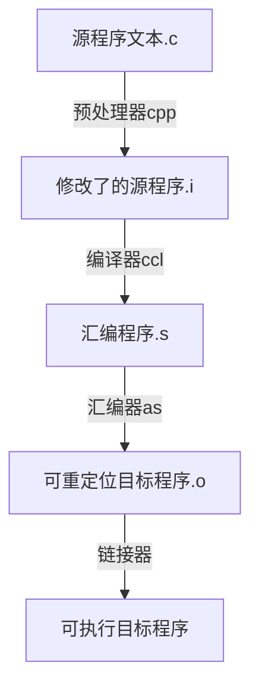

[TOC]

# 计算机系统漫游

* 计算机系统是由硬件和系统软件组成的

## 信息就是位+上下文

大部分的现代操作系统都使用ASCII标准类表示文本字符,这种方式实际上就是用一个唯一的单字节大小的整数值来表示每个字符

> C语言是贝尔实验室的Dennis Ritchie于1969年~1973年间创建的.美国国家标准学会(American National Standards Institute, ANSI)在1989年颁布了ANSI C的标准,后来C语言的标准化成了国际标准化组织(International Standards Organization, ISO)的责任.这些标准定义了C语言和一系列函数库,即所谓的C标准库.Kernighan和Ritchie在他们的经典著作中描述了ANSI C,这本著作被人们满怀感情地称为"K&R" .用Ritchie的话·来说, C语言是“古怪的、有缺陷的,但同时也是一个巨大的成功”.为什么会成功呢?
>
> * c语言与Unix操作系统关系密切.C从一开始就是作为一种用于Unix系统的程序语言开发出来的.大部分Unix内核(操作系统的核心部分),以及所有支撑工具和函数库都是用C语言编写的.20世纪70年代后期到80年代初期, Unix风行于高等院校,许多人开始接触C语言并喜欢上它.因为Unix几乎全部是用C编写的,它可以很为便地移植到新的机器上,这种特点为C和Unix赢得丁更为广泛的支特.
> * C语言小而简单.C语言的设计是由一个人而非一个协会掌控的,因此这是一个简洁明了、没有什么冗赘的设计. K&R这本书用大量的例子和练习描述了完整的C语言及其标准库,而全书不过261页.C语言的简单使它相对而言易于学习,也易于移植到不同的计算机上.
> * C语言是为实践目的设计的.C语言是设计用来实现Unix操作系统的.后来,其他人发现能够用这门语言无障碍地编写他们想要的程序.

## 程序被其他程序翻译成不同的格式

* 预处理阶段.预处理器(cpp)根据以字符#开头的命令,修改原始的C程序.比如hello.c中第1行的#include <stdio.h>命令告诉预处理器读取系统头文stdio.h的内容,并把它直接插入程序文本中.结果就得到了另一个C程序,通是以.i作为文件扩展名.
* 编译阶段.编译器(ccl)将文本文件hello.i翻译成文本文件hello.s,它包含一个汇编语言程序.
* 汇编阶段.接下来,汇编器(as)将hello.s翻译成机器语言指令,把这些指令打包成一种叫做可重定位目标程序(relocatable object program)的格式,并将结果保存在目标文件hello.o中.hello.o文件是一个二进制文件,它包含的17个字节是函数main的指令编码.如果我们在文本编辑器中打开hello.o文件,将看到一堆乱码.
* 链接阶段.请注意, hello程序调用了printf函数,它是每个C编译器都提供的标准C库中的一个函数.printf函数存在于一个名为printf.o的单独的预编译好了的目标文件中,而这个文件必须以某种方式合并到我们的hello..程序中.链接器(ld)就负责处理这种合并.结果就得到hello文件,它是一个可执行目标文件(或者简称为可执行文件),可以被加载到内存中,由系统执行.

> GCC是GNU(GNU是GNU's Not Unix的缩写)项目开发出来的众多有用工具之一. GNU项目是1984年由Richard Stallman发起的一个免税的慈善项目.该项目的目标非常宏大,就是开发出一个完整的类Unix的系统,其源代码能够不受限制地被修改和传播.GNU项目已经开发出了一个包含Unix操作系统的所有主要部件的环境,但内核除外, 内核是由Linux项目独立发展而来的.GNU环境包括EMACS编辑器、GCC编译器、GDB调试器、汇编器、链接器、处理二进制文件的工具以及其他一些部件.GCC编译器已经发展到支持许多不同的语言,能够为许多不同的机器生成代码.支持的语言包括C. C++、Fortran, Java, Pascal、面向对象C语言(Objective-C)和Ada.
>
> GNU项目取得了非凡的成绩,但是却常常被忽略.现代开放源码运动(通常和Linux联系在一起)的思想起源是GNU项目中自由软件(free software)的概念.(此处的free为自由言论(free speech)中的“自由”之意,而非免费啤酒(free beer)中的“免费”之意.)而且, Linux如此受欢迎在很大程度上还要归功于GNU工具,它们给Linux内核提供了环境.

## 了解编译系统如何工作是大有益处的

* 优化程序性能
* 理解链接时出现的错误
* 避免安全漏洞

## 处理器读并解释储存在内存中的指令

shell是一个命令行解释器,它输出一个提示符,等待输入一个命令行,然后执行这个命令.如果该命令行的第一个单词不是一个内置的shell命令,那么shell就会假设这是一个可执行文件的名字,它将加载并运行这个文件.

### 系统的硬件组成

#### 总线

贯穿整个系统的是一组电子管道,称作总线,它携带信息字节并负责在各个部件间传递.通常总线被设计成传送定长的字节块,也就是字(word).字中的字节数(即字长)是·个基本的系统参数,各个系统中都不尽相同.现在的大多数机器字长要么是4个字节(32位),要么是8个字节(64位)

#### I/O设备

I/0(输入/输出)设备是系统与外部世界的联系通道.

#### 主存

主存是一个临时存储设备,在处理器执行程序时,用来存放程序和程序处理的数据.从物理上来说,主存是由一组动态随机存取存储器(DRAM)芯片组成的.从逻辑上来说,存储器是一个线性的字节数组,每个字节都有其唯一的地址(数组索引),这些地址是从零开始的.一般来说,组成程序的每条机器指令都由不同数量的字节构成.与C程序变量相对应的数据项的大小是根据类型变化的.

#### 处理器

中央处理单元(CPU) ,简称处理器,是解释(或执行)存储在主存中指令的引擎.处理器的核心是一个大小为一个字的存储设备(或寄存器),称为程序计数器(PC).在任何时刻, PC都指向主存中的某条机器语言指令(即含有该条指令的地址),e从系统通电开始,直到系统断电,处理器一直在不断地执行程序计数器指向的指令,再更新程序计数器,使其指向下一条指令.处理器看上去是按照一个非常简单的指令执行模型来操作的,这个模型是由指令集架构决定的.在这个模型中,指令按照严格的顺序执行,而执行一条指令包含执行一系列的步骤.处理器从程序计数器指向的内存处读取指令,解释指令中的位,执行该指令指示的简单操作,然后更新PC,使其指向下一条指令,而这条指令并不一定和在内存中刚刚执行的指令相邻.

* 加载:从主存复制一个字节或者一个字到寄存器,以覆盖寄存器原来的内容.
* 存储:从寄存器复制一个字节或者一个字到主存的某个位置,以覆盖这个位置上原来的内容.
* 操作:把两个寄存器的内容复制到ALU, ALU对这两个字做算术运算,并将结果存放到一个寄存器中,以覆盖该寄存器中原来的内容.
* 跳转:从指令本身中抽取一个字,并将这个字复制到程序计数器(PC)中,以覆盖PC中原来的值.

## 高速缓存至关重要

根据机械原理,较大的存储设备要比较小的存储设备运行得慢,而快速设备的造价远高于同类的低速设备.

类似地,一个典型的寄存器文件只存储几百字节的信息,而主存里可存放几十亿字节.然而,处理器从寄存器文件中读数据比从主存中读取几乎要快100倍.更麻烦的是,随着这些年半导体技术的进步,这种处理器与主存之间的差距还在持续增大.加快处理器的运行速度比加快主存的运行速度要容易和便宜得多.

针对这种处理器与主存之间的差异,系统设计者采用了更小更快的存储设备,称为高速缓存存储器(cache memory,简称为cache或高速缓存),作为暂时的集结区域,存放处理器近期可能会需要的信息.

高速缓存的局部性原理,即程序具有访问局部区域里的数据和代码的趋势.通过让高速缓存里存放可能经常访问的数据,大部分的内存操作都能在快速的高速缓存中完成.

存储器层次结构

## 操作系统管理硬件

我们可以把操作系统看成是应用程序和硬件之间插入的一层软件.

所有应用程序对硬件的操作尝试都必须通过操作系统.

操作系统有两个基本功能: (1)防止硬件被失控的应用程序滥用; (2)向应用程序提供简单一致的机制来控制复杂而又通常大不相同的低级硬件设备.操作系统通过几个基本的抽象概念(进程、虚拟内存和文件)来实现这两个功能.

### 进程

程序在现代系统上运行时,操作系统会提供一种假象,就好像系统上只有这个程序在运行.程序看上去是独占地使用处理器、主存和I/O设备.处理器看上去就像在不间断地一条接一条地执行程序中的指令,即该程序的代码和数据是系统内存中唯一的对象.这些假象是通过进程的概念来实现的,进程是计算机科学中最重要和最成功的概念之一

进程是操作系统对一个正在运行的程序的一种抽象.在一个系统上可以同时运行多个进程,而每个进程都好像在独占地使用硬件.而并发运行,则是说一个进程的指令和另一个进程的指令是交错执行的.在大多数系统中,需要运行的进程数是多于可以运行它们的CPU个数的.传统系统在一个时刻只能执行一个程序,而先进的多核处理器同时能够执行多个程序.无论是在单核还是多核系统中,一个CPU看上去都像是在并发地执行多个进程,这是通过处理器在进程间切换来实现的.操作系统实现这种交错执行的机制称为上下文切换.

操作系统保持跟踪进程运行所需的所有状态信息.这种状态,也就是上下文,包括许多信息,比如PC和寄存器文件的当前值,以及主存的内容.在任何一个时刻,单处理器系统都只能执行一个进程的代码.当操作系统决定要把控制权从当前进程转移到某个新进程时,就会进行上下文切换,即保存当前进程的上下文、恢复新进程的上下文,然后将控制权传递到新进程.新进程就会从它上次停止的地方开始.

### 线程

尽管通常我们认为一个进程只有单一的控制流,但是在现代系统中,一个进程实际上可以由多个称为线程的执行单元组成,每个线程都运行在进程的上下文中,并共享同样的代码和全局数据

由于网络服务器中对并行处理的需求,线程成为越来越重要的编程模型,因为多线程之间比多进程之间更容易共享数据,也因为线程一般来说都比进程更高效.当有多处理器可用的时候,多线程也是一种使得程序可以运行得更快的方法

### 虚拟内存

虚拟内存是一个抽象概念,它为每个进程提供了一个假象,即每个进程都在独占地使用主存.每个进程看到的内存都是一致的,称为虚拟地址空间

* 程序代码和数据.对所有的进程来说,代码是从同一固定地址开始,紧接着的是和C全局变量相对应的数据位置.
* 堆.代码和数据区后紧随着的是运行时堆.代码和数据区在进程一开始运行时就被指定了大小,与此不同,当调用像malloc和free这样的C标准库函数时,堆可以在运行时动态地扩展和收缩.
* 共享库.大约在地址空间的中间部分是一块用来存放像C标准库和数学库这样的共享库的代码和数据的区域.共享库的概念非常强大,也相当难懂.
* 栈.位于用户虚拟地址空间顶部的是用户栈,编译器用它来实现函数调用.和堆一样,用户栈在程序执行期间可以动态地扩展和收缩.特别地,每次我们调用一个函数时,栈就会增长;从一个函数返回时,栈就会收缩.
* 内核虚拟内存.地址空间顶部的区域是为内核保留的.不允许应用程序读写这个区域的内容或者直接调用内核代码定义的函数.相反,它们必须调用内核来执行这些操作.虚拟内存的运作需要硬件和操作系统软件之间精密复杂的交互,包括对处理器生成的每个地址的硬件翻译.基本思想是把一个进程虚拟内存的内容存储在磁盘上,然后用主存作为磁盘的高速缓存.

## 系统之间利用网络通信

系统漫游至此,我们一直是把系统视为一个孤立的硬件和软件的集合体.实际上,系统经常通过网络和其他系统连接到一起.从一个单独的系统来看,网络可视为一个I/O设备.当系统从主存复制一串字节到网络适配器时,数据流经过网络到达另一台机器,而不是比如说到达本地磁盘驱动器.相似地,系统可以读取从其他机器发送来的数据,并把数据复制到自己的主存.

随着Internet这样的全球网络的出现,从一台主机复制信息到另外一台主机已经成为计算机系统最重要的用途之一.比如,像电子邮件、即时通信、万维网、FTP和telnet这样的应用都是基于网络复制信息的功能.

## Amdahl定律

Gene Amdahl,计算领域的早期先锋之一,对提升系统某一部分性能所带来的效果做出了简单却有见地的观察.这个观察被称为Amdahl定律(Amdahl's law),该定律的主要思想是,当我们对系统的某个部分加速时,其对系统整体性能的影响取决于该部分的重要性和加速程度.若系统执行某应用程序需要时间为$T_{old}$.假设系统某部分所需执行时间与该时间的比例为$\alpha$,而该部分性能提升比例为k。即该部分初始所需时间为$aT_{old}$,现在所需时间为$aT_{old}/k$.因此,总的执行时间应为
$$
T_{new}=(1-\alpha)T_{old}+(\alpha T_{old})/k=T_{old}[(1-\alpha)+\alpha/k]
$$
加速比:$S=\frac{T_{old}}{T_{new}}$
$$
S=\frac{1}{(1-\alpha)+\alpha/k}
$$
一个主要部分做出了重大改进,但是获得的系统加速比却明显小于这部分的加速比.这就是Amdahl定律的主要观点-要想显著加速整个系统,必须提升全系统中相当大的部分的速度

### 并发和并行

数字计算机的整个历史中,有两个需求是驱动进步的持续动力:一个是我们想要计算机做得更多,另一个是我们想要计算机运行得更快.当处理器能够同时做更多的事情时,这两个因素都会改进.我们用的术语并发(concurrency)是一个通用的概念,指一个同时具有多个活动的系统;而术语并行( parallelism)指的是用并发来使一个系统运行得更快.并行可以在计算机系统的多个抽象层次上运用.在此,我们按照系统层次结构中由高到低的顺序重点强调三个层次

#### 线程级并发

构建在进程这个抽象之上,我们能够设计出同时有多个程序执行的系统,这就导致了并发.使用线程,我们甚至能够在一个进程中执行多个控制流.自20世纪60年代初期出现时间共享以来,计算机系统中就开始有了对并发执行的支持.传统意义上,这种并发执行只是模拟出来的,是通过使一台计算机在它正在执行的进程间快速切换来实现的.在以前,即使处理器必须在多个任务间切换,大多数实际的计算也都是由一个处理器来完成的.这种配置称为单处理器系统

超线程,有时称为同时多线程(simultaneous multi-threading),是一项允许一个CPU执行多个控制流的技术.它涉及CPU某些硬件有多个备份,比如程序计数器和寄存器文件,而其他的硬件部分只有一份,比如执行浮点算术运算的单元.常规的处理器需要大约20000个时钟周期做不同线程间的转换,而超线程的处理器可以在单个周期的基础上决定要执行哪一个线程.这使得CPU能够更好地利用它的处理资源.

多处理器的使用可以从两方面提高系统性能.首先,它减少了在执行多个任务时模拟并发的需要.正如前面提到的,即使是只有一个用户使用的个人计算机也需要并发地执行多个活动.其次,它可以使应用程序运行得更快,当然,这必须要求程序是以多线程方式来书写的,这些线程可以并行地高效执行.因此,虽然并发原理的形成和研究已经超过50年的时间了,但是多核和超线程系统的出现才极大地激发了一种愿望,即找到书写应用程序的方法利用硬件开发线程级并行性.

#### 指令级并行

在较低的抽象层次上,现代处理器可以同时执行多条指令的属性称为指令级并行.

如果处理器可以达到比一个周期一条指令更快的执行速率,就称之为超标量(superscalar)处理器.大多数现代处理器都支持超标量操作

#### 单指令、多数据并行

在最低层次上,许多现代处理器拥有特殊的硬件,允许一条指令产生多个可以并行执行的操作,这种方式称为单指令、多数据,即SIMD并行.

提供这些SIMD指令多是为了提高处理影像、声音和视频数据应用的执行速度.

虽然有些编译器会试图从C程序中自动抽取SIMD并行性,但是更可靠的方法是用编译器支持的特殊的向量数据类型来写程序,比如GCC就支持向量数据类型.

### 计算机系统中抽象的重要性

抽象的使用是计算机科学中最为重要的概念之一

不同的编程语言提供不同形式和等级的抽象支持.在处理器里,指令集架构提供了对实际处理器硬件的抽象.使用这个抽象,机器代码程序表现得就好像运行在一个一次只执行一条指令的处理器上.底层的硬件远比抽象描述的要复杂精细,它并行地执行多条指令,但又总是与那个简单有序的模型保持一致.只要执行模型一样,不同的处理器实现也能执行同样的机器代码,而又提供不同的开销和性能.

# 程序结构和执行

## 信息的表示和处理

现代计算机存储和处理的信息以二值信号表示.这些微不足道的二进制数字,或者称为位(bit),形成了数字革命的基础.使用十进制表示法是很自然的事情,但是当构造存储和处理信息的机器时,二进制值工作得更好.二值信号能够很容易地被表示、存储和传输.

对二值信号进行存储和执行计算的电子电路非常简单和可靠,制造商能够在一个单独的硅片上集成数百万甚至数十亿个这样的电路.

孤立地讲,单个的位不是非常有用.然而,当把位组合在一起,再加上某种解释(interpretation),即赋予不同的可能位模式以含意,我们就能够表示任何有限集合的元素.通过使用标准的字符码,我们能够对文档中的字母和符号进行编码.

我们研究三种最重要的数字表示.无符号(unsigned)编码基于传统的二进制表示法,表示大于或者等于零的数字.补码(two's-complement)编码是表示有符号整数的最常见的方式,有符号整数就是可以为正或者为负的数字.浮点数(floating-point)编码是表示实数的科学记数法的以2为基数的版本.计算机用这些不同的表示方法实现算术运算,例如加法和乘法,类似于对应的整数和实数运算

通过研究数字的实际表示,我们能够了解可以表示的值的范围和不同算术运算的属性.为了使编写的程序能在全部数值范围内正确工作,而且具有可以跨越不同机器、操作系统和编译器组合的可移植性,了解这种属性是非常重要的.后面我们会讲到,大量计算·机的安全漏洞都是由于计算机算术运算的微妙细节引发的.在早期,当人们碰巧触发了程序漏洞,只会给人们带来一些不便,但是现在,有众多的黑客企图利用他们能找到的任何漏洞,不经过授权就进入他人的系统.这就要求程序员有更多的责任和义务,去了解他们的程序如何工作,以及如何被迫产生不良的行为

## 信息存储

大多数计算机使用8位的块,或者字节(byte),作为最小的可寻址的内存单位,而不是访问内存中单独的位.机器级程序将内存视为一个非常大的字节数组,称为虚拟内存(virtual memory),内存的每个字节都由一个唯一的数字来标识,称为它的地址(address),所有可能地址的集合就称为虚拟地址空间(virtual address space).顾名思义,这个虚拟地址空间只是一个展现给机器级程序的概念性映像.实际的实现是将动态随机访问存储器(DRAM)、闪存、磁盘存储器、特殊硬件和操作系统软件结合起来,为程序提供一个看上去统一的字节数组.

C编译器还把每个指针和类型信息联系起来,这样就可以根据指针值的类型,生成不同的机器级代码来访问存储在指针所指向位置处的值.尽管C编译器维护着这个类型信息,但是它生成的实际机器级程序并不包含关于数据类型的信息.每个程序对象可以简单地视为一个字节块,而程序本身就是一个字节序列.

> C语言中指针的作用指针是C语言的一个重要特性.它提供了引用数据结构(包括数组)的元素的机制.与变量类似,指针也有两个方面:值和类型.它的值表示某个对象的位置,而它的类型表示那个位置上所存储对象的类型(比如整数或者浮点数)

### 十六进制表示法

一个字节由8位组成.在二进制表示法中,它的值域是$000000_2 \backsim 11111111_2$ 如果看成十进制整数,它的值域就是$0_{10}\backsim255_{10}$.两种符号表示法对于描述位模式来说都不是非常方便.二进制表示法太冗长,而十进制表示法与位模式的互相转化很麻烦.替代的方法是以16为基数,或者叫做十六进制(hexadecimal)数,来表示位模式.

十六进制(简写为"hex")使用数字’0’, ~ ‘9’,以及字符’A’ ~ ‘F’,来表示16个可能的值

在C语言中,以0x或0x开头的数字常量被认为是十六进制的值

### 字数据大小

每台计算机都有一个字长(word size) ,指明指针数据的标称大小(nominal size),因为虚拟地址是以这样的一个字来编码的,所以字长决定的最重要的系统参数就是虚拟地址空间的最大大小.也就是说,对于一个字长为$w$位的机器而言,虚拟地址的范围为$0\backsim2^w-1$,程序最多访问$2^w$个字节

为了避免由于依赖“典型”大小和不同编译器设置带来的奇怪行为, ISO C99引入了一类数据类型,其数据大小是固定的,不随编译器和机器设置而变化.其中就有数据类型int32_t和int64_t,它们分别为4个字节和8个字节.使用确定大小的整数类型是程序员准确控制数据表示的最佳途径

程序员应该力图使他们的程序在不同的机器和编译器上可移植.可移植性的一个方面就是使程序对不同数据类型的确切大小不敏感。C语言标准对不同数据类型的数字范围设置了下界,但是却没有上界

### 寻址和字节顺序

对于跨越多字节的程序对象,我们必须建立两个规则:这个对象的地址是什么,以及在内存中如何排列这些字节.在几乎所有的机器上,多字节对象都被存储为连续的字节序列,对象的地址为所使用字节中最小的地址

对于大多数应用程序员来说,其机器所使用的字节顺序是完全不可见的.无论为哪种类型的机器所编译的程序都会得到同样的结果.不过有时候,字节顺序会成为问题.在不同类型的机器之间通过网络传送二进制数据时,一个常见的问题是当小端法机器产生的数据被发送到大端法机器或者反过来时,接收程序会发现,字里的字节成了反序的.为了避免这类问题,网络应用程序的代码编写必须遵守已建立的关于字节顺序的规则,以确保发送方机器将它的内部表示转换成网络标准,而接收方机器则将网络标准转换为它的内部表示

对于int类型的数据,除了字节顺序以外,我们在所有机器上都得到相同的结果.特别地,我们可以看到在Linux 32、 Windows和Linux 64上,最低有效字节值0x39最先输出,这说明它们是小端法机器;而在Sun上最后输出,这说明Sun是大端法机器.同样地, float数据的字节,除了字节顺序以外,也都是相同的.另一方面,指针值却是完全不同的.不同的机器/操作系统配置使用不同的存储分配规则.一个值得注意的特性是Linux 32, Windows和Sun的机器使用4字节地址,而Linux 64使用8字节地址

> 使用printf格式化输出
>
> printf函数(还有它的同类fprintf和sprintf)提供了一种打印信息的方式,这种方式对格式化细节有相当大的控制能力.第一个参数是格式串(format string),而其余的参数都是要打印的值.在格式串里,每个以“%”开始的字符序列都表示如何格式化下一个参数

> 文字编码的Unicode标准
>
> ASCII字符集适合于编码英语文档,但是在表达一些特殊字符方面并没有太多办法,例如法语的“Ç".它完全不适合编码希腊语、俄语和中文等语言的文档.这些年提出了很多方法来对不同语言的文字进行编码。Unicode联合会(Unicode Consortium)修订了最全面且广泛接受的文字编码标准.当前的Unicode标准(7.0版)的字库包括将近100000个字符,支持广泛的语言种类,包括古埃及和巴比伦的语言.为了保持信用, Unicode技术委员会否决了为Klingon(即电视连续剧《星际迷航》中的虚构文明)编写语言标准的提议.
>
> 基本编码,称为Unicode的“统一字符集”,使用32位来表示字符.这好像要求文本串中每个字符要占用4个字节.不过,可以有一些替代编码,常见的字符只需要1个或2个字节,而不太常用的字符需要多一些的字节数.特别地, UTF-8表示将每个字符编码为一个字节序列,这样标准ASCII字符还是使用和它们在ASCII中一样的单字节编码,这也就意味着所有的ASCII字节序列用ASCII码表示和用UTF-8表示是一样的。Java编程语言使用Unicode来表示字符串.对于C语言也有支持Unicode的程序库

### 表示代码

我们发现指令编码是不同的.不同的机器类型使用不同的且不兼容的指令和编码方·式.即使是完全一样的进程,运行在不同的操作系统上也会有不同的编码规则,因此二进制代码是不兼容的.二进制代码很少能在不同机器和操作系统组合之间移植

### 布尔代数简介

二进制值是计算机编码、存储和操作信息的核心,所以围绕数值0和1的研究已经演化,出了丰富的数学知识体系。这起源于1850年前后乔治·布尔(George Boole, 1815-1864)的工作,因此也称为布尔代数(Boolean algebra),布尔注意到通过将逻辑值TRUE (真)和FALSE(假)编码为二进制值1和0,能够设计出一种代数,以研究逻辑推理的基本原则

# 参考

* 深入理解计算机系统(原书第三版)

